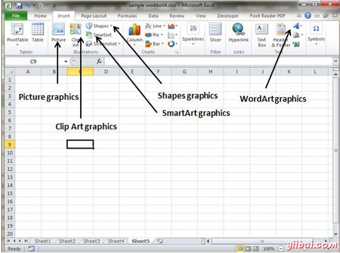
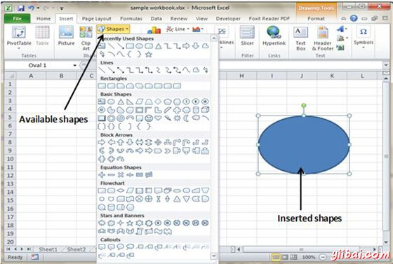
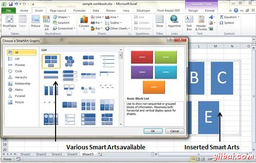
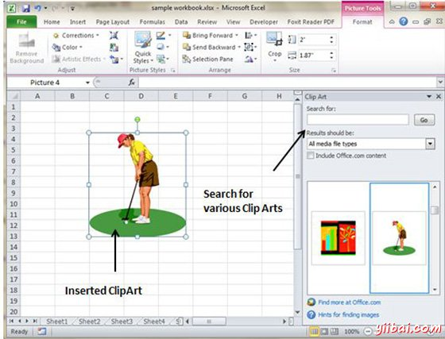

# Excel添加图形 - Excel教程

## 在MS Excel的图形对象

MS Excel支持各种类型的图形对象，如形状画廊，SmartArt，文本框和艺术字可用功能区在插入选项卡上。图形在插入选项卡可用。请参见下面的截图在MS Excel 2010中的各种可用的图形。

## 插入形状

*   选择插入选项卡»图形下拉

*   选择要插入的形状。单击形状将其插入。

*   编辑插入的形状只需拖动形状的鼠标。形状将调整形状。

## 插入智能艺术

*   选择插入标签»SmartArt

*   点击SmartArt将打开SmartArt对话，如下屏幕截图。从可用smartArts列表选择

*   点击SmartArt将其插入工作表

*   编辑SmartArt，按你的需要

## 插入剪贴画

*   选择插入标签»剪贴画

*   单击剪贴画将打开搜索框如下屏幕截图。从可用剪贴画的列表

*   点击剪贴画以将其插入工作表

## 插入艺术字

*   选择插入标签»艺术字

*   选择你喜欢的艺术字样式，然后单击它在它输入文本。

