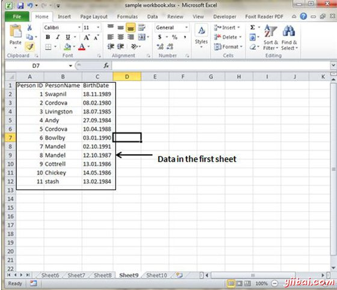
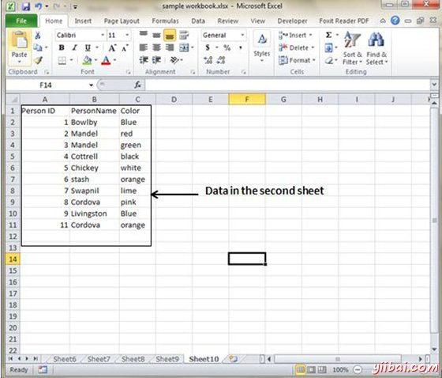
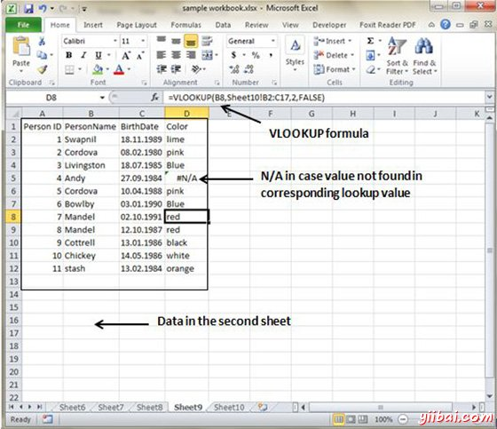

# Excel交叉参考 - Excel教程

## 在MS Excel的图形对象

当你有信息分散在几个不同的电子表格，它似乎是一项艰巨的任务，把所有这些不同的数据集在一起成一个有意义的列表或表格。这是VLOOKUP函数进入它自己。

## VLOOKUP

VLOOKUP搜索垂直向下的查找表的一个值。 VLOOKUP(lookup_value，table_array，Col_index_num，range_lookup)有4个参数如下。

*   lookup_value : 它是用户输入。这是该函数用于搜索的值。

*   The table_array : 它是表中单元格所在的区域。这不仅包括列被搜索，也会得到所需要的值的数据列。

*   Col_index_num : 这是数据包含想要的答案列。

*   Range_lookup : 这是一个TRUE或FALSE值。当设置为TRUE，查找函数给出最接近lookup_value，而无需在lookup_value。当设置为false，精确匹配，必须找到对lookup_value或函数将返回＃N / A。注意， 这需要包含lookup_value列按升序进行格式化。

## VLOOKUP 例子

让我们来看看交叉参考两幅电子表格的一个很简单的例子。每个电子表格包含了同一组人的信息。第一个电子表格有他们的出生日期，而第二显示自己喜欢的颜色。我们如何建立一个列表，显示这个人的姓名，出生日期和自己喜欢的颜色。VLOOOKUP将有助于在这种情况下。首先让我们来看看在这两个表的数据。

这是在第一个电子表的数据

这是在第二个电子表的数据

现在，从另一片找到相应喜爱的颜色，我们需要VLOOKUP数据。第一个参数是VLOOKUP查找值（在这种情况下，它是人的名字）。第二个参数是在表阵列中，表中第二板从B2到C11。 第三个参数是VLOOKUP列索引NUM这就是回答，我们所期待的。在这种情况下，它是2的颜色的列数为2。 第四个参数是真返回部分匹配或假返回精确匹配。应用VLOOKUP公式之后，将计算出的颜色和结果显示如下。

正如你可以在上面的屏幕截图的VLOOKUP结果已搜索颜色第二张表中看到。在未找到匹配它返回＃N / A的情况下。在这种情况下，Andy的数据不存在于所述第二电子表格，以便它返回＃N / A。

