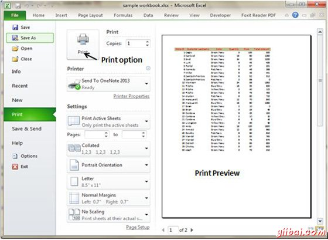
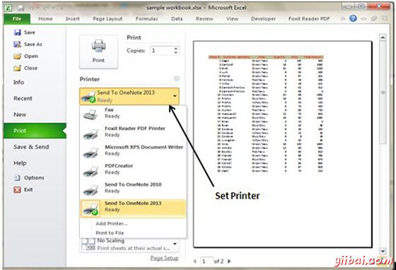
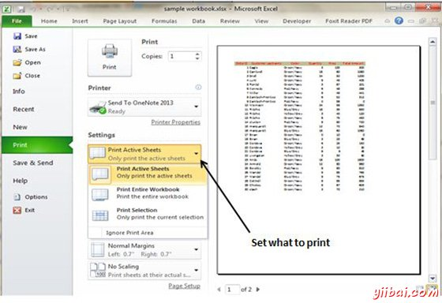

# Excel打印工作表 - Excel教程

## 快速打印

如果你要打印工作表的副本没有布局的调整，使用快速打印选项。我们可以使用此选项有两种方式。

*   选择文件»打印(其中显示了打印窗格)，然后点击打印按钮。

*   按下Ctrl + P键，然后点击打印按钮(或按Enter键)。

## 常见的调整页面设置

您可以调整在不同的方式如下页面设置对话框提供的打印设置。页面设置选项包括页面方向，页面尺寸，页边距等。

*   在Backstage视图打印屏幕，显示当你选择 文件»打印

*   功能区的页面布局选项卡

## 选择您的打印机

要切换到不同的打印机，选择文件»打印并使用下拉控制在打印机部分选择不同的安装的打印机。

## 指定要打印的内容

有时你可能需要打印工作表，而不是整个活动区域中的一部分。选择文件»打印并使用控件设置部分指定要打印的内容。

*   活动表：打印所选的活动工作表或表

*   整个工作簿：打印整个工作簿，包括图表工作表

*   选择：只打印选择文件»打印前选择的范围

