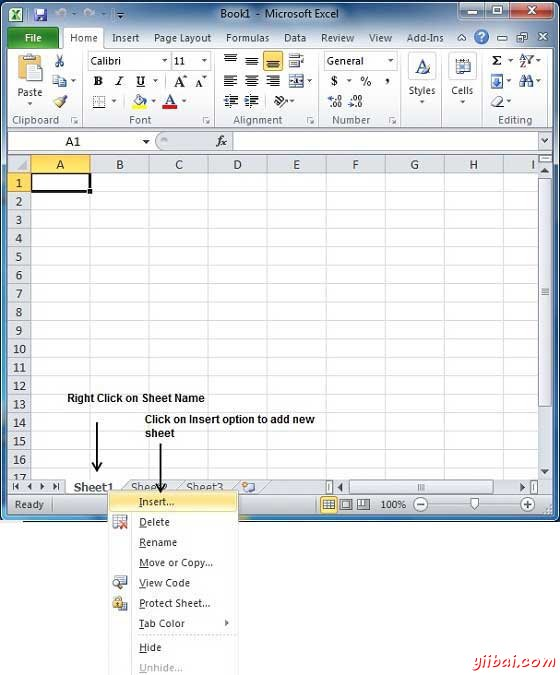
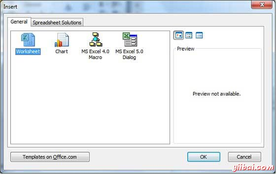
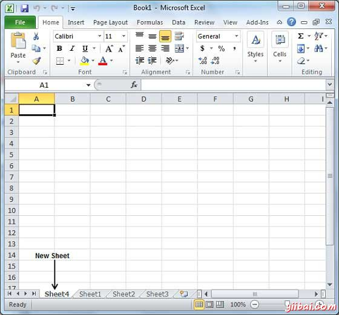

# Excel创建工作表 - Excel教程

## 创建新的工作表

三张新的空白工作表总是在您启动Microsoft Excel时打开。但是，假设你想工作在另一个工作表上时，或者关闭已打开的工作表，并希望开始一个新的工作表开始另一个新的工作表。下面是用来创建一个新的工作表的步骤：

步骤(1)：右键单击工作表名称并选择插入选项。

步骤（2）：现在你会看到有选择工作表选项对话框从普通选项卡插入，选中。单击OK按钮

现在，应该有一个空白的工作表，如下图所示准备开始输入文字。

您可以随时使用一个捷径来创建一个空白工作表。尝试使用Shift + F11键，你会看到类似上面的表一个新的空白工作表打开。

