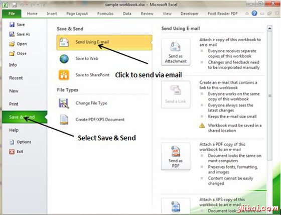
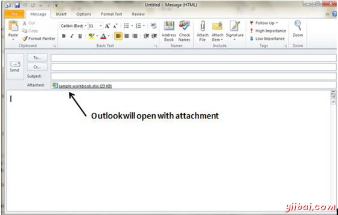

# Excel电子邮件簿 - Excel教程

## 电子邮件簿

MS Excel中，您可以非常容易地通过电子邮件发送工作簿。要通过电子邮件发送工作簿给任何人请按以下步骤操作。

*   选择文件»保存和发送。它基本上是第一个，然后保存文档后发送电子邮件。

*   点击使用E-mail发送。如果您的电子邮件系统有配置。MS Outlook将与文件作为附件的电子邮件的新窗口中打开。您可以将这个工作簿发送邮件给任何人，在有效的电子邮件地址。

