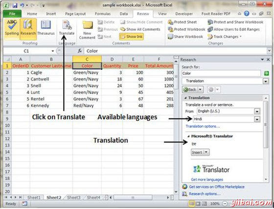

# Excel翻译工作表 - Excel教程

## Excel翻译工作表

你可以翻译文本写在不同的语言，比如词组或段落，个别字(通过使用迷你翻译)，或使用MS Excel2010转换整个文件。

翻译可用在MS Excel 2010色带选项中，您可以迅速转化成单元不同的语言与此选项的审查选项卡可用。

## 翻译一步一步完成

*   选择您想要翻译成不同的语言的内容。

*   选择审查标签»翻译。

*   这将打开您可以从中选择需要翻译的语言窗格。

*   需要互联网连接进行转换。这转化使用微软翻译。

*   点击插入到应用平移更改。

