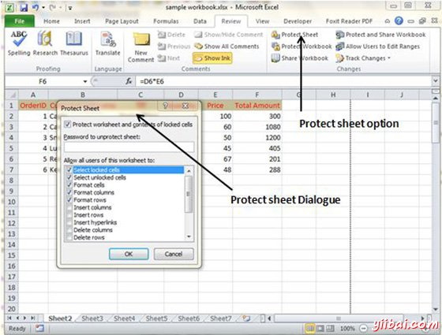
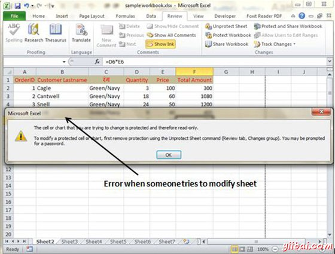
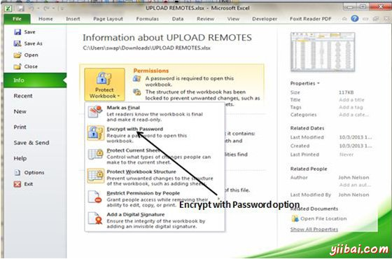
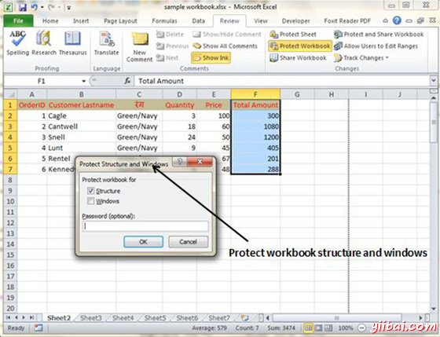

# Excel工作簿安全 - Excel教程

## 工作簿安全

我们可以通过在色带的审查选项卡中提供保护的概念应用安全工作簿。MS Excel保护相关的功能分为三类。

*   **工作表保护：**被修改保护工作表，或限制修改某些用户。

*   **工作簿保护：**从具有插入或删除表，并且还需要使用密码来打开工作簿保护工作簿

## 保护工作表

可能想要保护工作表出于各种原因。其中一个原因是为了防止自己或他人意外删除公式或其他关键数据。 一个常见的情况是，以保护一个工作表，使得数据可以被改变，但公式不能被改变。

为了保护工作表，选择评论»更改组»保护工作表。Excel显示保护工作表对话框。需要注意的是，提供密码是可选的。如果你输入密码，密码将用于取消工作表。可以选择的各种选项，其工作表受到保护。假设我们选中单元格格式选项，则Excel将不允许设置单元格格式。

当有人试图单元格格式化，会得到如下错误。

要解除保护工作表，选择审查»更改组»撤消工作表保护。如果工作表受密码保护，系统会提示您输入密码。

## 保护工作簿

Excel提供了三种方法来保护工作簿。

*   需要密码才能打开工作簿。

*   防止用户从添加表，删除表，隐藏表和取消隐藏工作表。

*   阻止用户从改变窗口的大小或位置。

## 需要密码来打开工作簿

Excel中可以让你使用密码保存工作簿。这样做之后，任何人试图打开工作簿时必须输入密码。要将密码添加到工作簿，请按照下列步骤。

*   选择[文件]»信息»保护工作簿»加密，具有密码。 Excel显示加密文档对话框。

*   键入密码，然后单击确定。

*   再次键入密码，然后单击确定。

*   保存工作簿。

要从工作簿中删除密码，重复相同的过程。在步骤2中，不过删除现有的密码符号。

## 保护工作簿的结构和Windows

为了防止他人（或自己）在工作簿中执行某些操作，可以保护工作簿的结构和窗口。当一个工作簿的结构和窗口被保护，则用户可能不添加工作表，删除工作表，隐藏工作表，取消隐藏工作表等，并可能不允许分别改变工作簿的视窗大小或位置。

要保护工作表的结构和Windows，按照以下步骤

*   选择审查»更改组»保护工作簿，以显示保护工作簿对话框。

*   在保护工作簿对话框中，选中结构复选框和Windows复选框。

*   （可选）输入密码。

*   点击确定。

