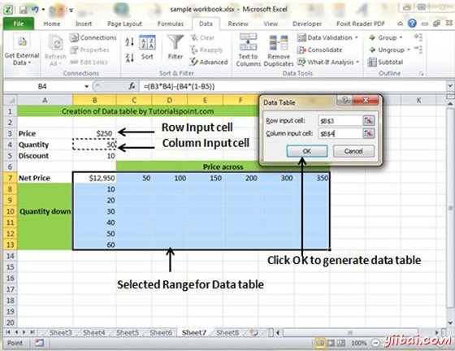

# Excel数据表 - Excel教程

## 数据表

在Excel中，一个数据表是一种通过改变公式输入单元格，而看到不同的结果。 数据表中提供在数据选项卡»假设分析下拉»数据表 在MS Excel

## 数据表实例

现在，让我们来看看数据表的概念，这里用一个例子来说明。假设有价格及数量的多个值。也由折扣计算净价，作为第三个变量。 你可以保持净价值在数据表的帮助下组织表格式。价格横向运行，以正确的数量，同时运行垂直向下。 我们正在使用的公式来计算净价格为价格乘以数量减去总折扣(数量 x 折扣)

现在制作数据表中的选择数据表的范围。 选择数据选项卡»假设分析下拉»数据表。它会出现对话要求输入行和输入列。得到的输入行作为价格单元格(在这种情况下单元为B3)和作为数量单元格的输入列(在这种情况下，单元格为B4)。请参见下面的屏幕截图。

如示于下面的屏幕截图点击确定将产生的数据表。它会生成表公式。您可以更改横向的价格或数量垂直的净价看到变化。

