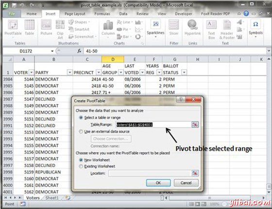
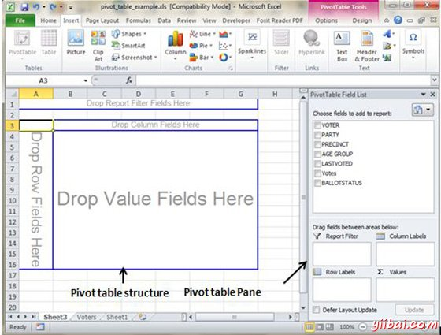
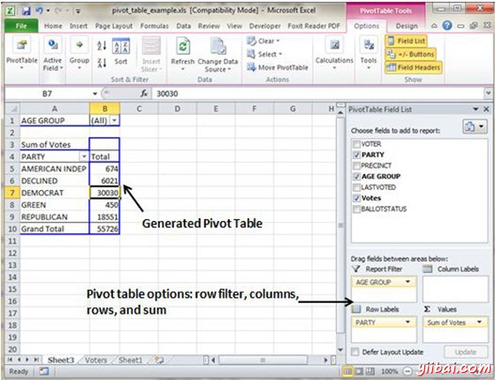

# Excel数据透视表 - Excel教程

## 数据透视表

数据透视表实质上是从数据库中生成的动态汇总报告。数据库可以存在于一个工作表(表中的形式)，或在外部数据文件。数据透视表可以帮助改变一排排和数字列到一个有意义的数据呈现。 数据透视表是非常强大的工具，为数据的汇总分析。

数据透视表是在插入选项卡»数据透视表下拉»透视表

## 数据透视表范例

现在，让我们来看看数据透视表的例子。假设你有选民庞大的数据，你希望看到每方选民信息的汇总数据，那么可以使用数据透视表。选择插入标签»数据透视表插入数据透视表。MS Excel选择表的数据。可以为现有表或新表选择透视表的位置。

这将生成数据在透视表窗格中，如下图所示。有如下透视表窗格提供的各种选项。您可以选择生成的数据透视表的字段。

*   **列标签：**有一列方向在数据透视表的字段。字段的每一项占据一列。

*   **报表过滤器：**您可以设置报表的过滤器，然后每年得到的数据按年份过滤。

*   **行标签：**具有行方向在数据透视表中的字段。字段每一项占据一行。

*   **值范围：**单元格透视表包含汇总数据。Excel提供了几种方法来汇总数据（求和，平均值，计数等等）。

以数据透视表给输入字段后，它将产生一个与数据如下数据透视表。

