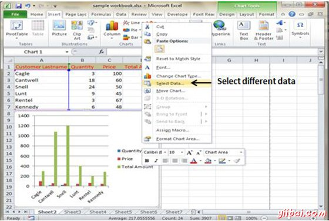

# Excel图表 - Excel教程

## 图表

图表是数值的可视化表示。图表(也称为图形)已成为电子表格的一个组成部分。早期的电子表格产品生成的图表是相当粗糙，但这么多年来有所显著的改善。 Excel为您提供的工具来创建各种高度可定制的图表。数据显示在一个周密的图表可以让数字更容易理解。因为图表呈现图像，图表是用于概括的一系列数字和它们的相互关系特别有用的。

## 图表类型

在MS Excel有各种可用的图表类型，如下面的屏幕快照。

*   **柱：**柱形图显示了一段时间的数据变化或图示项目之间的比较。

*   **块：**图表块项目之间的比较。

*   **饼图：**饼图显示项目构成一个数据系列，成比例的项目总和的大小。它总是只显示一个数据系列，当想强调的一个数据元素显著是非常有用的。

*   **线图：**线图显示趋势在相同时间的数据。

*   **区块：**区块图强调变化的幅度随着时间的推移。

*   **X Y 离散 :** 一个XY散点图显示中的几个数据系列的数值，或者地块两组数字为一体的系列XY坐标的关系。

*   **股票：**这种图表类型是最经常使用的股价数据，但也可用于科学数据（例如，以指示温度变化）。

*   **曲面：**当想找到两组数据之间的最佳组合曲面图是有用的。 如在地形图，颜色和图案表明，在相同的值范围的区域。

*   **圆环图：**像一个饼图，圆环图显示部分到整体的关系; 不过，它可以包含一个以上的数据系列。

*   **气泡：**被布置成列的工作表上，以便使x值列在第一列和相应的y值和气泡大小值列于相邻的列中的数据，可以绘制在气泡图。

*   **雷达：**雷达图比较多个数据系列的合计值。

## 创建图表

创建图表由下面的步骤数据。

*   选择您想要创建图表的数据。

*   选择插入标签»选择图表或单击图表组看到各种图表类型。

*   选择您所选择的图表，然后单击确定生成图表。

## 编辑图表

在已经创造了它之后，在任何时候，可以编辑图表。

*   可以选择不同的数据，图表输入，右键单击图表»选择数据。 选择新的数据将产生如在下面的屏幕截图图表按新的数据。

*   可以通过以图表的X轴给出不同的输入改变图表的X轴。

*   可以通过以图表的Y轴赋予不同的输入更改图表的Y轴。

