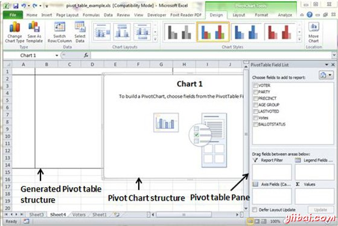
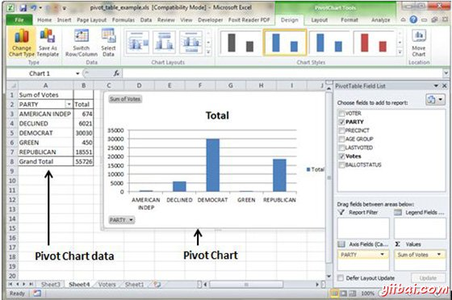

# Excel枢轴透视图表 - Excel教程

## 透视图表

枢轴表是透视表显示数据汇总的图形表示。枢轴表总是基于一个数据透视表。尽管Excel允许您创建一个数据透视表，并在同一时间一个数据透视图，但是不能创建一个没有数据透视表。 所有的Excel图表功能在一个数据透视图可用

透视图是在插入 选项卡»透视表下拉»数据透视图可用

## 透视图表示例

现在，让我们来看看数据透视表的例子。假设你有选民庞大的数据，希望以图表形式显示，可以使用数据透视表为它的每形式选民信息的数据汇总视图。选择插入标签»透视图表插入数据透视表。

MS Excel选择表的数据。您可以从现有表或新表选择数据透视图的位置。数据透视图将取决于自动创建透视表在MS Excel中。可以在下面的屏幕截图中所生成的数据透视图

