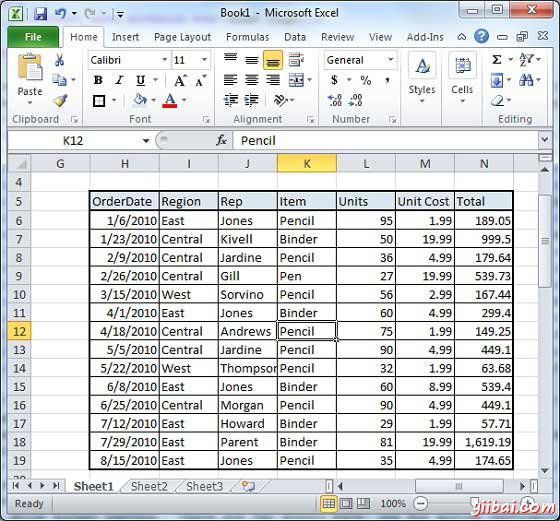
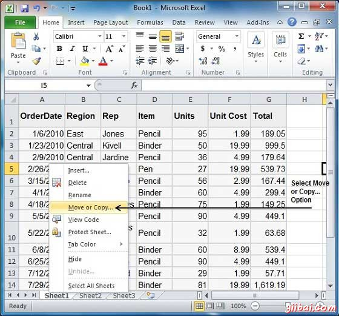
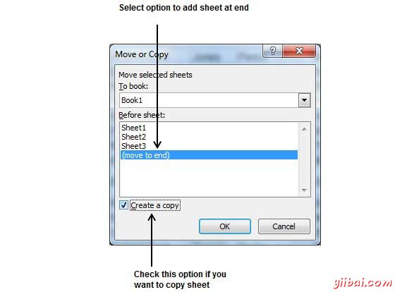
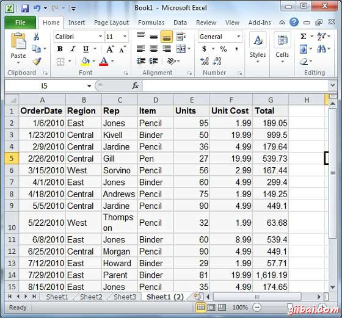

# Excel复制工作表 - Excel教程

## 复制工作表

首先在创建一些示例文本之前，我们继续。 打开一个新的Excel表，然后键入一些数据。我们已经截图所示如下的样本数据。

| OrderDate | Region | Rep | Item | Units | Unit Cost | Total |
| --- | --- | --- | --- | --- | --- | --- |
| 1/6/2010 | East | Jones | Pencil | 95 | 1.99 | 189.05 |
| 1/23/2010 | Central | Kivell | Binder | 50 | 19.99 | 999.5 |
| 2/9/2010 | Central | Jardine | Pencil | 36 | 4.99 | 179.64 |
| 2/26/2010 | Central | Gill | Pen | 27 | 19.99 | 539.73 |
| 3/15/2010 | West | Sorvino | Pencil | 56 | 2.99 | 167.44 |
| 4/1/2010 | East | Jones | Binder | 60 | 4.99 | 299.4 |
| 4/18/2010 | Central | Andrews | Pencil | 75 | 1.99 | 149.25 |
| 5/5/2010 | Central | Jardine | Pencil | 90 | 4.99 | 449.1 |
| 5/22/2010 | West | Thompson | Pencil | 32 | 1.99 | 63.68 |
| 6/8/2010 | East | Jones | Binder | 60 | 8.99 | 539.4 |
| 6/25/2010 | Central | Morgan | Pencil | 90 | 4.99 | 449.1 |
| 7/12/2010 | East | Howard | Binder | 29 | 1.99 | 57.71 |
| 7/29/2010 | East | Parent | Binder | 81 | 19.99 | 1,619.19 |
| 8/15/2010 | East | Jones | Pencil | 35 | 4.99 | 174.65 |

下面是复制整个工作表的步骤

**步骤(1)：**右键单击工作**表名称**，然后选择**移动**或**复制**选项。

**步骤(2)：**现在会看到移动或复制对话框，选择工作表选项在常规选项卡为选中状态。单击OK按钮

选择创建一个副本复选框以创建当前工作表的副本并在工作表的选项如(移至结束)，使新的工作表被创建。

按OK按钮

现在，你应该有一个复制工作表，如下图所示。

可以通过双击它重命名表名称。双击时，名称变为可编辑。输入名称为：Sheet5，然后按Tab键或回车键。

