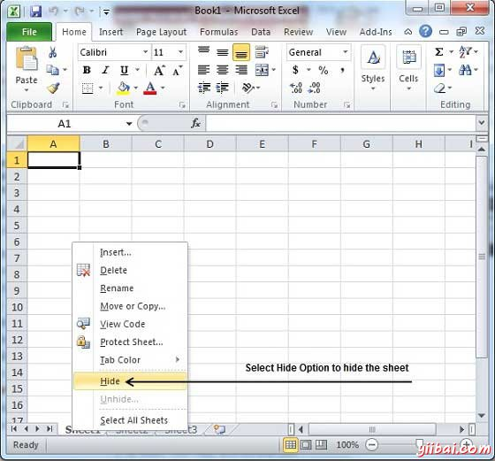
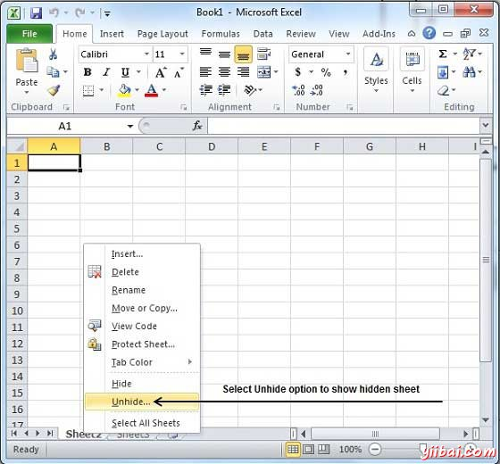

# Excel隐藏工作表 - Excel教程

## 隐藏工作表

下面是隐藏工作表的步骤

**步骤(1)**右键单击工作表名称并选择隐藏选项。工作表将得到隐藏。

## 取消隐藏工作表

下面是步骤来取消隐藏工作表

**步骤（1）**右键单击任何工作表名称，并选择取消隐藏...选项。

步骤（2）选择工作表名称中取消隐藏对话框中取消隐藏取消隐藏的工作表。

按OK键确认

现在，你自己隐藏工作表回来。

