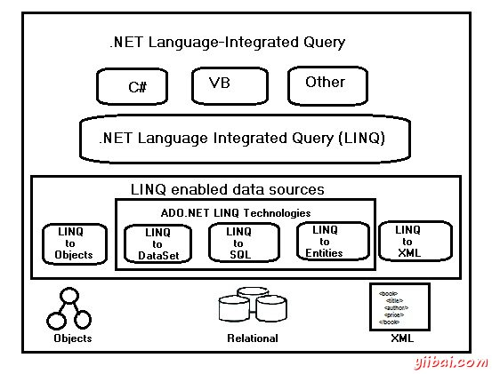

# LinQ教程

世界各地的开发者总是遇到查询的问题，因为缺乏一个定义的路径的数据，并需要掌握的技术，如SQL，Web服务的XQuery等。

在Visual Studio 2008中引入，由Anders Hejlsberg设计LINQ（语言集成查询）允许编写查询，即使没有查询语言，如SQL，XML等知识 LINQ查询，可以由不同的数据类型来写。

## LINQ查询示例

### C#

```
using System;
using System.Linq;

class Program
{
  static void Main()
  {
     string[] words = {"hello", "wonderful", "LINQ", "beautiful", "world"};
  	 //Get only short words
	 var shortWords = from word in words
	                  where word.Length <= 5
	                  select word;

	 //Print each word out
	 foreach (var word in shortWords)
	 {
	 	Console.WriteLine(word);
	 }	 
	 Console.ReadLine();
  }
}
```

### VB

```
Module Module1
  Sub Main()
     Dim words As String() = {"hello", "wonderful", "LINQ", "beautiful", "world"}

     ' Get only short words
     Dim shortWords = From word In words _
                      Where word.Length <= 5 _
                      Select word

     ' Print each word out.
     For Each word In shortWords
        Console.WriteLine(word)
     Next
     Console.ReadLine()
  End Sub
End Module	
```

当C＃或VB将上述代码被编译和执行时，它产生了以下结果：

```
hello 
LINQ 
world

```

## LINQ的语法

LINQ有两种语法。这些是以下物质。

*   Lamda (方法) 语法

    示例

    ```
    var longWords = words.Where( w =&gt; w.length &gt; 10);
    Dim longWords = words.Where(Function(w) w.length &gt; 10)
    ```

*   Query (理解) 语法

    示例

    ```
    var longwords = from w in words where w.length &gt; 10;
    Dim longwords = from w in words where w.length &gt; 10
    ```

## LINQ的类型

LINQ的类型在下面简要提及。

*   LINQ 到 Objects
*   LINQ 到XML(XLINQ)
*   LINQ 到 DataSet
*   LINQ 到 SQL (DLINQ)
*   LINQ 到 Entities

除上述外，还有一个名为PLINQ一个LINQ类型，这是微软并行LINQ。

## 在.NETLINQ体系结构

LINQ有3层架构，其中最上层是由语言扩展和底层组成，通常对象实现了IEnumerable&lt;T&gt;或IQueryable的&lt;T&gt;泛型接口的数据源。该体系结构如下图。



## 查询表达式

查询表达式不过是一个LINQ查询，表示类似于SQL的查询使用操作符，如select，Where 和 OrderBy的一种形式。查询表达式通常开始以关键字“From”。

访问标准的LINQ查询操作符，命名空间System.Query默认情况下应导入。这些表达式都写在C＃3.0声明性查询语法。

下面是一个例子来说明它由数据源创建一个完整的查询操作，查询表达式定义和查询执行。

C#

```
using System;
using System.Collections.Generic;
using System.Linq;
using System.Text;

namespace Operators
{
  class LINQQueryExpressions
  {
     static void Main()
     {
        // Specify the data source.
        int[] scores = new int[] { 97, 92, 81, 60 };

        // Define the query expression.
        IEnumerable<int> scoreQuery = from score in scores
                                            where score > 80
                                            select score;

           // Execute the query.
           foreach (int i in scoreQuery)
           {
              Console.Write(i + " ");
           }
           Console.ReadLine();
     }
  }
}
```

当上述代码被编译和执行时，它产生了以下结果：

```
97 92 81

```

## 扩展方法

引入.NET3.5，扩展方法只有静态类中声明，并允许包含自定义方法的对象进行一些精确的查询操作来扩展类，而不由这个类的实际成员。这些也可以被重载。

简而言之，扩展方法被用来转换查询表达式为传统的方法调用（面向对象）。

## LINQ和存储过程的区别

还有就是LINQ和存储过程之间存在差异的数组。这些差别将在下面提及。

*   存储过程比LINQ查询速度更快，因为它们遵循预期的执行计划。

*   在比较执行LINQ查询这很容易避免，而不是存储过程作为前者在编译时Visual Studio的智能提示支持，以及全类型检查运行时错误。

*   LINQ允许调试通过使用.NET调试器不是在存储过程。

*   LINQ提供了相对于存储过程，其中有必要重新写为数据库类型多样的代码的多个数据库的支持。

*   LINQ基于解决方案的部署是容易和简单，相比部署一套存储过程。

## LINQ的需要

在此之前LINQ，有必要学习C＃，SQL，和各种API结合在一起既要形成一个完整的应用程序。因为，这些数据源和编程语言面临的阻抗不匹配;需要短编码的感觉。

下面是在查询数据的LINQ来临之前有多少不同的技术中使用由开发的一个例子。

```
SqlConnection sqlConnection = new SqlConnection(connectString);
SqlConnection.Open();
System.Data.SqlClient.SqlCommand sqlCommand = new SqlCommand();
sqlCommand.Connection = sqlConnection;
sqlCommand.CommandText = "Select * from Customer";
return sqlCommand.ExecuteReader (CommandBehavior.CloseConnection)  
```

有趣的是，出了特征代码行，查询获取只有最后两个定义。使用LINQ，相同的数据的查询可以写成一个可读颜色编码形式象，如下面那太在很短提下列到之一。

```
Northwind db = new Northwind(@"C:\Data\Northwnd.mdf");
var query = from c in db.Customers
            select c;
```

## LINQ的优点

LINQ提供了一系列的优势，其中最重要的是其强大的表达能力，使开发表达声明。一些LINQ的优点如下。

*   LINQ提供语法高亮，证明有助于找出在设计时的错误。

*   LINQ提供智能感知这意味着很容易写更精确的查询。

*   写LINQ代码是相当快的，因此开发时间也被显著减少。

*   LINQ使得调试方便，因为它在C＃语言的集成。

*   两个表之间的关系看很容易使用LINQ由于其分层特征，这使得编写查询在更短的时间加入多个表。

*   LINQ允许一个单一的LINQ语法的使用，同时查询多个不同的数据源，这是主要是因为其统一的基础。

*   LINQ是可扩展的，这意味着有可能使用LINQ的知识来查询新的数据源类型。

*   LINQ提供了一个查询连接多个数据源，以及突破复杂问题转换为一组短的查询易于调试的工具。

*   LINQ提供易于改造转换一种数据类型到另一种，如SQL数据转换为XML数据。

