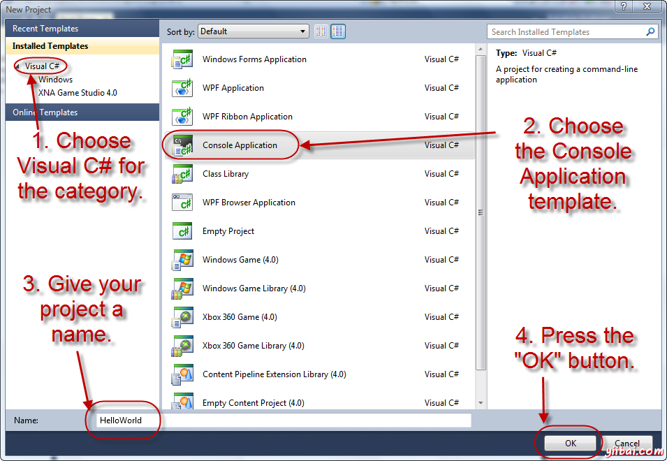

# LINQ环境安装设置 - LinQ教程

开始LINQ程序之前，最好先了解设立LINQ环境的细微差异。 LINQ需要.NET框架，一种革命性的平台有不同类型的应用程序。 LINQ查询可以写成无论是在C#或Visual Basic都很方便。

微软提供了这两种语言的工具，即在Visual Studio中编写的C#和Visual Basic。我们的例子都是编译并写在Visual Studio 2010中；但是，Visual Basic2013版的也可以使用。这是最新版本，并有许多相似之处与Visual Studio2012。

## 在Windows7安装Visual Studio 2010

Visual Studio可以从像DVD安装介质进行安装。需要管理员权限才能成功地在系统上安装Visual Basic2010。重要的是如果断开所有可移动USB否则安装可能会失败。一些硬件要求具有用于安装必需如下所述。

### 硬件要求：

*   1.6 GHz 或 更高
*   1 GB RAM
*   3 GB(可用硬盘空间)
*   5400 RPM 硬盘驱动器
*   DirectX 9 兼容的视频卡
*   DVD-ROM 驱动

### 安装步骤：

*   步骤 1. 首先使用Visual Studio2010包，在插入DVD后，点击从媒体出现在屏幕上的弹出框安装或运行程序。

*   步骤 2.现在设置了Visual Studio后会出现在屏幕上。选择 Install Microsoft Visual Studio 2010.

    &lt;center&gt;&lt;/center&gt;

*   步骤  3. 只要点击，它的进程将得到发起和设立窗口将出现在屏幕上。加载安装组件，将需要一些时间完成后，单击 Next 按钮进入下一步。

    &lt;center&gt;&lt;/center&gt;

*   步骤  4. 这是安装的最后一步，并开始页面将出现在其中只是选择“我已阅读并接受许可条款”，然后单击Next按钮。

    &lt;center&gt;&lt;/center&gt;

*   步骤  5.现在选择功能出现在屏幕上的安装选项。您可以选择Full 或 Custom选项。如果你有比磁盘空间要求所需的显示更少的磁盘空间，那么请定制安装。

    &lt;center&gt;&lt;/center&gt;

*   Step 6.当选择自定义选项，会出现下面的窗口。选择想要安装，点击更新或者前往第7步；建议不要去自定义选项，因为在未来，你可能需要选择了不具备的功能。

    &lt;center&gt;&lt;/center&gt;

    不久，一个弹出窗口会显示并安装将启动这可能需要很长的时间。请记住，这是要安装了所有组件。

    &lt;center&gt;&lt;/center&gt;

    最后，能够在安装已成功完成一个窗口查看一条消息。

    &lt;center&gt;&lt;/center&gt;

## 在Visual Studio 2010中使用C#写LINQ程序

*   1\. 启动Visual Studio2010终极版，然后从菜单选择文件后新建项目。

*   2\. 一个新的项目对话框会出现在屏幕上。

*   3\. 现在选择的Visual C#作为已安装的模板下的一个类别，下一个选择控制台应用程序模板，如下图所示。

    &lt;center&gt;&lt;/center&gt;

*   4\. 提供一个名称，在底部的名称框，然后点击 OK。

*   5\. 新项目将出现在解决方案资源管理器中的一个新的对话框屏幕上的右侧。

    &lt;center&gt;&lt;/center&gt;

*   6\. 现在，从解决方案资源管理器中选择Program.cs中，您可以在其中启动编辑器窗口查看代码使用 ‘using System’.

*   7\. 在这里，可以开始编写下面的C#程序。

    ```
    using System;
    using System.Collections.Generic;
    using System.Linq;
    using System.Text;

    namespace HelloWorld
    {
      class Program
      {
         static void Main(string[] args)
    	 {
    	    Console.WriteLine("Hello World")
    		Console.ReadKey();
    	 } 		
      }
    }

    ```

*   8\. 按F5键运行项目。强烈建议保存项目通过选择文件&gt;全部保存在运行项目之前。

## 在Visual Studio 2010中使用LINQ 写VB程序

*   1.启动Visual Studio2010终极版，然后选择文件后新建项目从菜单。

*   2.新项目对话框将出现在屏幕上。

*   3\. 现在，选择Visual Basic中已安装的模板，下一个选择控制台应用程序模板，下一个类别。

*   4\. 提供一个名称，在底部的名称框，然后按OK。

*   5\. 得到Module1.vb 如屏幕中内容。从这里开始使用LINQ 编写VB代码。

    ```
    Module Module1
      Sub Main()
         Console.WriteLine("Hello World")
         Console.ReadLine()
      End Sub
    End Module   

    ```

*   6\. 按F5键运行项目。强烈建议保存项目通过选择文件&gt;全部保存在运行项目之前。

当C3或VB上面的代码被编译和运行，它会产生以下结果：

