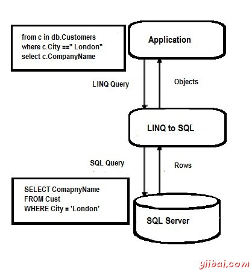
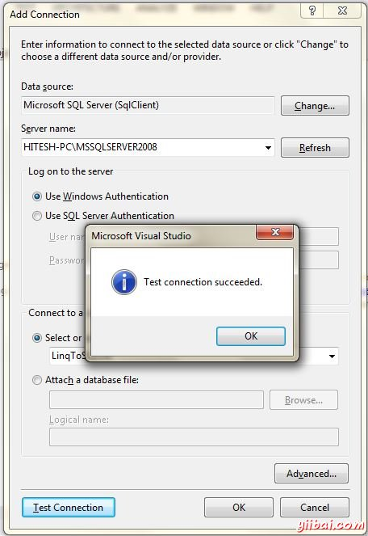
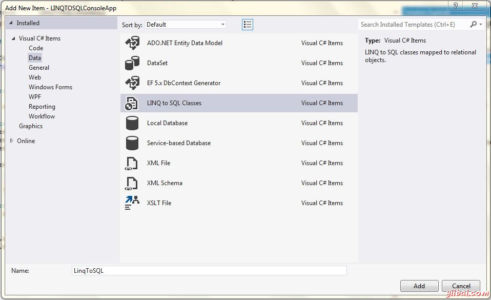
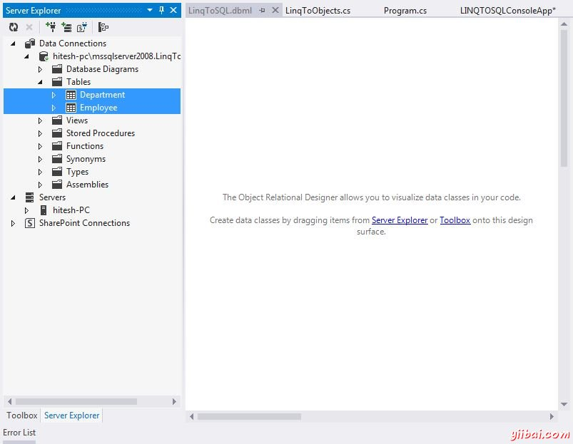
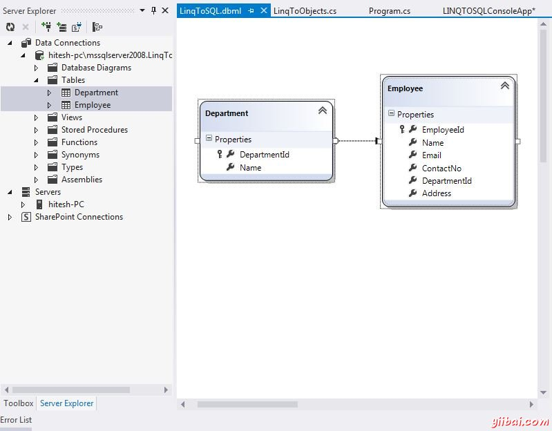

# LINQ SQL - LinQ教程

LINQ为SQL提供了一个基础结构(运行时间)，关系数据作为对象的管理。 这是3.5版本的.NET框架的一个组成部分，并巧妙地做对象模型到SQL的语言集成查询的转换。这些查询被发送给数据库来执行。从数据库中获得的结果后，LINQ到SQL再次它们转换为对象。

## LINQ到SQL简介

对于大多数ASP.NET开发，LINQ到SQL（也称为DLINQ）是Langauage集成查询通用部分，因为这允许在SQL服务器数据库查询数据通过使用常规的LINQ表达式。它还允许更新，删除和插入数据，但它受到的唯一缺点是它受SQL服务器数据库的限制。 但是，也有LINQ的许多好处，SQL在ADO.NET一样降低了复杂性，编码等等。

下面是表示LINQ执行架构到SQL的示意图。



## 如何使用LINQ到SQL?

*   步骤 1: 创建一个新的“数据连接”到数据库服务器。View -&gt; Server Explorer -&gt; Data Connections -&gt; Add Connection

    &lt;center style="box-sizing: border-box;"&gt;&lt;/center&gt;

*   步骤2: 添加LINQ 到 SQL类文件

    &lt;center style="box-sizing: border-box;"&gt;&lt;/center&gt;

*   步骤 3: 选择数据库并拖动表格拖放到新的LINQ 到 SQL类文件。

    &lt;center style="box-sizing: border-box;"&gt;&lt;/center&gt;

*   步骤 4: 添加表类文件。

    &lt;center style="box-sizing: border-box;"&gt;&lt;/center&gt;

## 使用LINQ到SQL查询

执行一个查询使用LINQ到SQL规则类似到一个标准的LINQ查询，即 执行查询或者延迟或马上执行。 在执行使用LINQ到SQL查询的发挥作用，这些都是下述的组件。

*   **LINQ到SQL API** – 请求查询执行代表一个应用程序，并把它交给LINQ到SQL提供程序

*   **LINQ 到SQL提供程序** - 转换查询到Transact SQL（T-SQL），并发送新的查询到ADO提供程序执行

*   **ADO 提供程序** - 执行查询之后，发送结果在一个DataReader形式的LINQ 到 SQL，提供这反过来将其转换成用户的对象的形式

应当指出的是，在进行一个LINQ到SQL查询之前，重要的是要连接到经由DataContext类的数据源。

## 使用LINQ 到SQL插入，更新和删除

### 添加或插入

#### C#

```
using System;
using System.Linq;

namespace LINQtoSQL
{
  class LinqToSQLCRUD
  {
     static void Main(string[] args)
     {
        string connectString = System.Configuration.ConfigurationManager.ConnectionStrings["LinqToSQLDBConnectionString"].ToString();

        LinqToSQLDataContext db = new LinqToSQLDataContext(connectString);           

        //Create new Employee
        Employee newEmployee = new Employee();
        newEmployee.Name = "Michael";
        newEmployee.Email = "yourname@companyname.com";
        newEmployee.ContactNo = "343434343";
        newEmployee.DepartmentId = 3;
        newEmployee.Address = "Michael - USA";

        //Add new Employee to database
        db.Employees.InsertOnSubmit(newEmployee);

        //Save changes to Database.
        db.SubmitChanges();

        //Get new Inserted Employee            
        Employee insertedEmployee = db.Employees.FirstOrDefault(e =>e.Name.Equals("Michael"));

        Console.WriteLine("Employee Id = {0} , Name = {1}, Email = {2}, ContactNo = {3}, Address = {4}",
                          insertedEmployee.EmployeeId, insertedEmployee.Name, insertedEmployee.Email, 
                          insertedEmployee.ContactNo, insertedEmployee.Address);

        Console.WriteLine("\nPress any key to continue.");
        Console.ReadKey();
     }
  }
}
```

#### VB

```
Module Module1
  Sub Main()
     Dim connectString As String = System.Configuration.ConfigurationManager.ConnectionStrings("LinqToSQLDBConnectionString").ToString()

     Dim db As New LinqToSQLDataContext(connectString)

     Dim newEmployee As New Employee()
     newEmployee.Name = "Michael"
     newEmployee.Email = "yourname@companyname.com"
     newEmployee.ContactNo = "343434343"
     newEmployee.DepartmentId = 3
     newEmployee.Address = "Michael - USA"

     db.Employees.InsertOnSubmit(newEmployee)

     db.SubmitChanges()

     Dim insertedEmployee As Employee = db.Employees.FirstOrDefault(Function(e) e.Name.Equals("Michael"))

     Console.WriteLine("Employee Id = {0} , Name = {1}, Email = {2}, ContactNo = {3}, Address = {4}", insertedEmployee.EmployeeId, insertedEmployee.Name, insertedEmployee.Email, insertedEmployee.ContactNo, insertedEmployee.Address)

     Console.WriteLine(vbLf & "Press any key to continue.")
     Console.ReadKey()
  End Sub
End Module
```

当C#或VB上面的代码被编译并运行，它会产生以下结果：

```
Emplyee ID = 4, Name = Michael, Email = yourname@companyname.com, ContactNo = 
343434343, Address = Michael - USA

Press any key to continue.

```

### 更新

#### C#

```
using System;
using System.Linq;

namespace LINQtoSQL
{
  class LinqToSQLCRUD
  {
     static void Main(string[] args)
     {
        string connectString = System.Configuration.ConfigurationManager.ConnectionStrings["LinqToSQLDBConnectionString"].ToString();

        LinqToSQLDataContext db = new LinqToSQLDataContext(connectString);

        //Get Employee for update
        Employee employee = db.Employees.FirstOrDefault(e =>e.Name.Equals("Michael"));

        employee.Name = "George Michael";
        employee.Email = "yourname@companyname.com";
        employee.ContactNo = "99999999";
        employee.DepartmentId = 2;
        employee.Address = "Michael George - UK";

        //Save changes to Database.
        db.SubmitChanges();

        //Get Updated Employee            
        Employee updatedEmployee = db.Employees.FirstOrDefault(e =>e.Name.Equals("George Michael"));

        Console.WriteLine("Employee Id = {0} , Name = {1}, Email = {2}, ContactNo = {3}, Address = {4}",
                          updatedEmployee.EmployeeId, updatedEmployee.Name, updatedEmployee.Email, 
                          updatedEmployee.ContactNo, updatedEmployee.Address);

        Console.WriteLine("\nPress any key to continue.");
        Console.ReadKey();
     }
  }
}
```

#### VB

```
Module Module1
  Sub Main()
     Dim connectString As String = System.Configuration.ConfigurationManager.ConnectionStrings("LinqToSQLDBConnectionString").ToString()

     Dim db As New LinqToSQLDataContext(connectString)

     Dim employee As Employee = db.Employees.FirstOrDefault(Function(e) e.Name.Equals("Michael"))

     employee.Name = "George Michael"
     employee.Email = "yourname@companyname.com"
     employee.ContactNo = "99999999"
     employee.DepartmentId = 2
     employee.Address = "Michael George - UK"

     db.SubmitChanges()

     Dim updatedEmployee As Employee = db.Employees.FirstOrDefault(Function(e) e.Name.Equals("George Michael"))

     Console.WriteLine("Employee Id = {0} , Name = {1}, Email = {2}, ContactNo = {3}, Address = {4}", updatedEmployee.EmployeeId, updatedEmployee.Name, updatedEmployee.Email, updatedEmployee.ContactNo, updatedEmployee.Address)

     Console.WriteLine(vbLf & "Press any key to continue.")
     Console.ReadKey()
  End Sub
End Module
```

当C#或VB上面的代码被编译并运行，它会产生以下结果：

```
Emplyee ID = 4, Name = George Michael, Email = yourname@companyname.com, ContactNo = 
999999999, Address = Michael George - UK

Press any key to continue.

```

### 删除

#### C#

```
using System;
using System.Linq;

namespace LINQtoSQL
{
  class LinqToSQLCRUD
  {
     static void Main(string[] args)
     {
        string connectString = System.Configuration.ConfigurationManager.ConnectionStrings["LinqToSQLDBConnectionString"].ToString();

        LinqToSQLDataContext db = newLinqToSQLDataContext(connectString);

        //Get Employee to Delete
        Employee deleteEmployee = db.Employees.FirstOrDefault(e =>e.Name.Equals("George Michael"));

        //Delete Employee
        db.Employees.DeleteOnSubmit(deleteEmployee);

        //Save changes to Database.
        db.SubmitChanges();

        //Get All Employee from Database
        var employeeList = db.Employees;
        foreach (Employee employee in employeeList)
        {
           Console.WriteLine("Employee Id = {0} , Name = {1}, Email = {2}, ContactNo = {3}",
                             employee.EmployeeId, employee.Name, employee.Email, employee.ContactNo);
        }            

        Console.WriteLine("\nPress any key to continue.");
        Console.ReadKey();
     }
  }
}
```

#### VB

```
Module Module1
  Sub Main()
     Dim connectString As String = System.Configuration.ConfigurationManager.ConnectionStrings("LinqToSQLDBConnectionString").ToString()

     Dim db As New LinqToSQLDataContext(connectString)

     Dim deleteEmployee As Employee = db.Employees.FirstOrDefault(Function(e) e.Name.Equals("George Michael"))

     db.Employees.DeleteOnSubmit(deleteEmployee)

     db.SubmitChanges()

     Dim employeeList = db.Employees
     For Each employee As Employee In employeeList
        Console.WriteLine("Employee Id = {0} , Name = {1}, Email = {2}, ContactNo = {3}", employee.EmployeeId, employee.Name, employee.Email, employee.ContactNo)
     Next 

     Console.WriteLine(vbLf & "Press any key to continue.")
     Console.ReadKey()
  End Sub
End Module
```

当C#或VB上面的代码被编译并运行，它会产生以下结果：

```
Emplyee ID = 1, Name = William, Email = abc@gy.co, ContactNo = 999999999
Emplyee ID = 2, Name = Miley, Email = amp@esds.sds, ContactNo = 999999999
Emplyee ID = 3, Name = Benjamin, Email = asdsad@asdsa.dsd, ContactNo = 

Press any key to continue.
```

