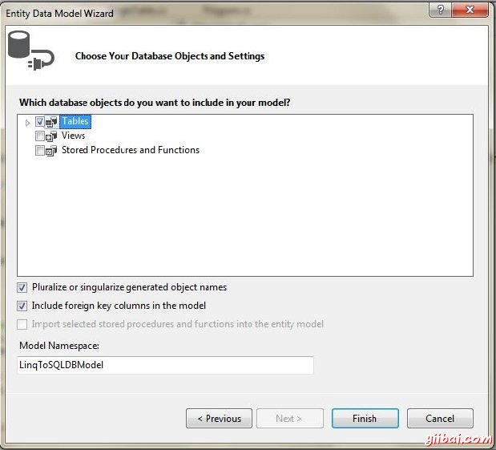
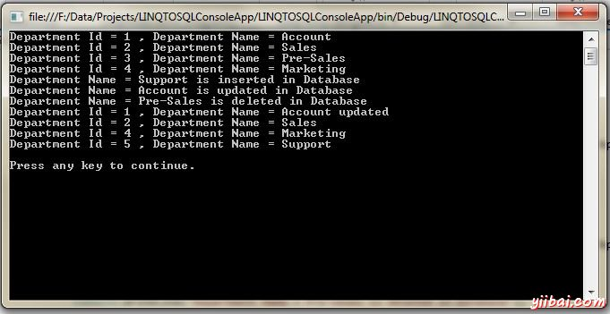

# LINQ实体 - LinQ教程

作为ADO.NET实体框架的一部分，LINQ到实体比LINQ到SQL更灵活，但由于其复杂性和缺乏关键功能没有太大的普及。但是，它没有LINQ的限制SQL允许数据查询，只能在SQL服务器数据库LINQ到实体中查询大量数据，如Oracle，MySQL等资料提供方便数据查询

此外，它已经得到了在这个意义上，用户可以使用一个数据源控件执行通过LINQ到实体查询，结果没有任何需要额外的编码有利于结合从ASP.Net支持。

LINQ到实体具有这些优点成为了标准机制，LINQ对数据库的使用。另外，也可以与LINQ实体来改变查询的数据的信息和容易批量更新。最有趣的是有关LINQ到实体具有像SQL相同的语法，甚至有同组标准查询运算符，如加入，选择，排序等等。

## LINQ 到Entities查询的创建和执行过程

*   建设一个ObjectQuery的实例ObjectContext（实体连接）
*   通过使用新建成的情况下构成C#或Visual Basic（VB）查询
*   转换LINQ的标准查询操作符，以及LINQ表达式到命令树
*   执行直接传递到遇到客户端任何异常查询
*   返回到客户机的所有查询结果

ObjectContext是这里的主类，使与实体数据模型或换句话说相互作用充当连接LINQ到数据库的桥. 命令树是这里与实体框架兼容的查询表示。 实体框架，另一方面实际上是对象关系映射器一般简称ORM，由做业务对象的产生，以及实体按照数据库表，便于各种基本操作，如创建，更新，删除和读取。

下面是一个图表实体框架到更好地了解这一概念的。


## 使用LINQ实体模型添加，更新和删除示例

首先添加实体模型按以下步骤。

*   步骤 1: 右键单击项目，然后单击添加新项目将打开的窗口中按如下。选择ADO.NET实体数据模型，并指定名称，然后单击添加。

    &lt;center style="box-sizing: border-box;"&gt;&lt;/center&gt;

*   步骤 2: 选择从数据库生成。

    &lt;center style="box-sizing: border-box;"&gt;&lt;/center&gt;

*   步骤 3: 选择数据库连接。

    &lt;center style="box-sizing: border-box;"&gt;&lt;/center&gt;

*   步骤 4: 选择所有表

    &lt;center style="box-sizing: border-box;"&gt;&lt;/center&gt;

现在写下面的代码。

```
using DataAccess;
using System;
using System.Linq;

namespace LINQTOSQLConsoleApp
{
  public class LinqToEntityModel
  {
     static void Main(string[] args)
     {
        using (LinqToSQLDBEntities context = new LinqToSQLDBEntities())
        {
           //Get the List of Departments from Database
           var departmentList = from d in context.Departments
           select d;

           foreach (var dept in departmentList)
           {
              Console.WriteLine("Department Id = {0} , Department Name = {1}",
                                dept.DepartmentId, dept.Name);
           }

           //Add new Department
           DataAccess.Department department = new DataAccess.Department();
           department.Name = "Support";

           context.Departments.Add(department);
           context.SaveChanges();

           Console.WriteLine("Department Name = Support is inserted in Database");

           //Update existing Department
           DataAccess.Department updateDepartment = context.Departments.FirstOrDefault(d =>d.DepartmentId == 1);
           updateDepartment.Name = "Account updated";
           context.SaveChanges();

           Console.WriteLine("Department Name = Account is updated in Database");

           //Delete existing Department
           DataAccess.Department deleteDepartment = context.Departments.FirstOrDefault(d =>d.DepartmentId == 3);
           context.Departments.Remove(deleteDepartment);
           context.SaveChanges();

           Console.WriteLine("Department Name = Pre-Sales is deleted in Database");

           //Get the Updated List of Departments from Database
           departmentList = from d in context.Departments
           select d;

           foreach (var dept in departmentList)
           {
              Console.WriteLine("Department Id = {0} , Department Name = {1}",
                                dept.DepartmentId, dept.Name);
           }
        }

        Console.WriteLine("\nPress any key to continue.");
        Console.ReadKey();
     }
  }
}
```

让我们编译和运行上面的程序，这将产生以下结果：



