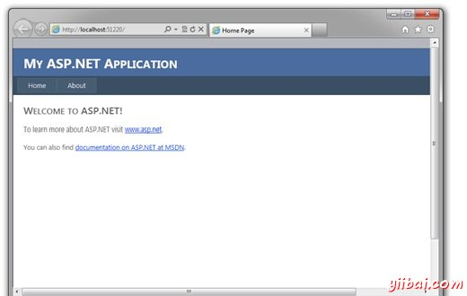
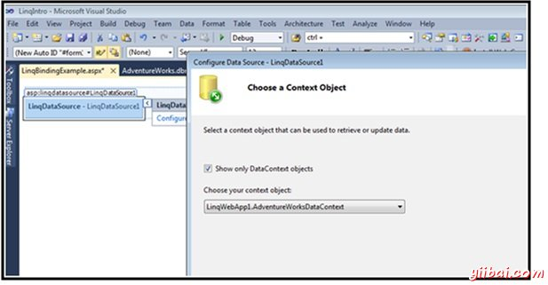

# LINQ ASP.Net - LinQ教程

作为一组.NET框架的扩展，LINQ是首选的机制，通过ASP.NET开发人员的数据访问。ASP.NET3.5有一个内置的工具LINQDataSource控件，使LINQ容易使用ASP.NET。ASP.NET使用上述控制作为数据源。现实生活中的项目大多包括网站或Windows应用程序等到更好地了解LINQ与ASP.NET的概念，让我们开始创建一个ASP.NET网站，使用LINQ功能。

对于这一点，必须在系统上得到安装了Visual Studio和.NET框架。一旦你已经打开的Visual Studio，转到 File -&gt; New -&gt; Website。一个弹出窗口将在如下图所示打开。


现在根据在左手侧上的模板，将有两个语言选项创建的网站。选择Visual C#和ASP.NET选择空Web站点。

选择您要保存新的网站系统上的文件夹中。然后按确定，并很快解决方案资源管理器中出现一个包含所有网页文件在屏幕上。右键单击Default.aspx的在解决方案资源管理器，并选择查看在浏览器中查看默认ASP.NET网站在浏览器中。很快新的ASP.NET网站将得到像下图的网页浏览器中打开。



.aspx其实在ASP.NET网站上使用的主要文件扩展名。Visual Studio中默认创建的所有的基本的网站像主页和公司简介页面，您可以方便地将内容放在页面。产生用于该网站的代码自动注册，也可以查看。

## LinqDataSource控件

这是可能是更新，插入和在ASP.NET网站，LINQDataSource控件的帮助页面删除数据。其实完全没有必要规范SQL命令作为LINQDataSource控件采用动态对这种操作创造的命令。

控制使用户能够使一个ASP.NET网页使用LINQ的便利通过在标记文本属性设置。LinqDataSource非常相似SqlDataSource控件以及ObjectDataSource，因为它可以在结合其他ASP.NET用于控制本页到数据源上。 因此，我们必须有一个数据库来解释的LinqDataSource控件调用的各种功能。

在开始控制使用ASP.NET的网页表单解释之前，有必要打开Microsoft Visual Studio工具箱拖放LINQDataSource控件到ASP.NET网站的.aspx页面就像下图。



下一步是通过选择所有列的雇员记录配置的LinqDataSource如下。


现在添加一个GridView控件到.aspx页面并进行配置，如以下图所示。GridView控件是强大的，并提供灵活的数据。很快配置控制后，它会出现在浏览器中。


现在可以看到屏幕上为.aspx页面编码将是：

```
<!DOCTYPE html>
<html>
<head runat="server">
  <title></title>
</head>
<body>
  <form id="form1" runat="server">
  <div>
     <asp:GridView ID="GridView1" runat="server" AutoGenerateColumns="False"
          DataKeyNames="ContactID" DataSourceID="LINQDataSource1">
        <Columns>
           <asp:BoundField DataField="ContactID" HeaderText="ContactID"
                InsertVisible="False" ReadOnly="True" SortExpression="ContactID" />
           <asp:CheckBoxField DataField="NameStyle" HeaderText="NameStyle"
                SortExpression="NameStyle" />
           <asp:BoundField DataField="Title" HeaderText="Title" SortExpression="Title" />
           <asp:BoundField DataField="FirstName" HeaderText="FirstName"
                SortExpression="FirstName" />
           <asp:BoundField DataField="MiddleName" HeaderText="MiddleName"
                SortExpression="MiddleName" />
           <asp:BoundField DataField="LastName" HeaderText="LastName"
                SortExpression="LastName" />
           <asp:BoundField DataField="Suffix" HeaderText="Suffix"
                SortExpression="Suffix" />
           <asp:BoundField DataField="EmailAddress" HeaderText="EmailAddress"
                SortExpression="EmailAddress" />
        </Columns>
     </asp:GridView>
     <br />
  </div>
  <asp:LINQDataSource ID="LINQDataSource1" runat="server"
       ContextTypeName="LINQWebApp1.AdventureWorksDataContext" EntityTypeName=""
       TableName="Contacts">
  </asp:LINQDataSource>
  </form>
</body>
</html>
```

这里应该注意的是，这是至关重要的属性ContextTypeName设置为表示数据库的类。例如，在这里它被给定为LINQWebApp1.AdventureWorksDataContext作为这个动作会使LinqDataSource和数据库之间进行所需的连接。

## 如何使用LINQ来INSERT，UPDATE和DELETE在ASP.NET页面的数据？

严格完成所有上述步骤后，选择从LinqDataSource控件使用LinqDataSource任务，并选择所有三个框使插入，使更新，使来自同一就像如下所示删除：


很快声明标记起来会得到显示在屏幕上如以。

```
<asp:LINQDataSource 
  ContextTypeName="LINQWebApp1.AdventureWorksDataContext" 
  TableName="Contacts" 
  EnableUpdate="true" 
  EnableInsert="true" 
  EnableDelete="true" 
  ID="LINQDataSource1" 
  runat="server">
</asp:LINQDataSource>
```

现在，因为有多个行和列，最好是添加另一个控制你的命名为详细信息视图或主控低于网格视图控件来显示网格的选定行的只有细节的.aspx形式。选择详细信息视图控制的详细信息视图任务，选择如下图所示的复选框。


现在只需保存更改并按下Ctrl+ F5在浏览器中查看页面，现在可以删除，更新，插入的细节视图控件的记录。

