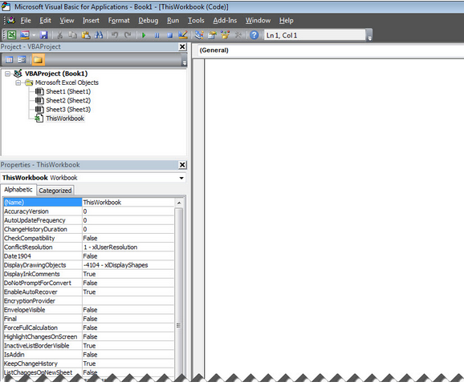

# VBA教程

VBA代表Visual Basic应用程序，是来自微软的事件驱动编程语言，目前主要有Microsoft Office应用程序，如MS-Excel，MS-Word和MS-Access中使用。

它可以帮助技术人员构建自定义的应用程序和解决方案，以增强这些应用程序的功能。这个设计的好处是，我们不必把Visual Basic安装我们的PC上，但安装Office将隐帮助我们达到目的。

我们可以在所有Office版本（从微软Office97至微软Office2013）直接使用，可用最新版本VBA。其中Excel的VBA是最流行的一种，并且我们可以建立在MS Excel中使用VBA非常强大的工具，包括使用线性程序。

## VBA的应用

为什么我们需要使用VBA在Excel中为MS-Excel本身提供了内置的功能负荷。 MS-Excel提供了唯一的基本内在功能而可能不足以执行复杂的计算。在这些情况下，VBA变成一种最明显好的解决方案。

其中一个最好的例子是非常难使用Excel内置计算贷款每月还款数，但很容易编写一个VBA这样计算。

## 访问VBA编辑器

在Excel窗口，按“Alt + F11”。打开VBA的窗口如下所示。

