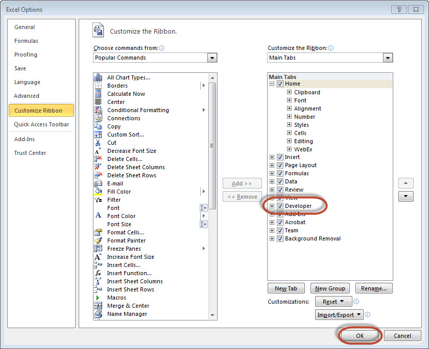
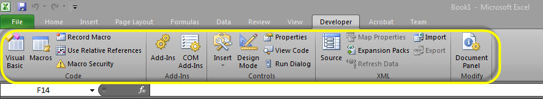
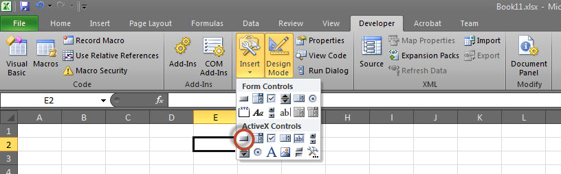
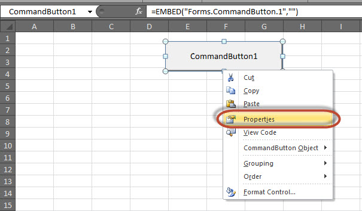
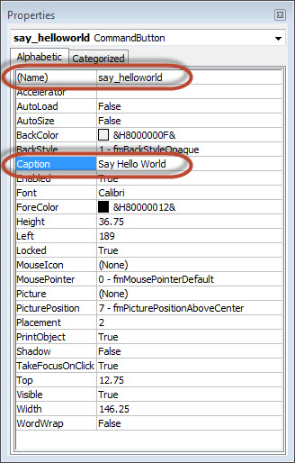
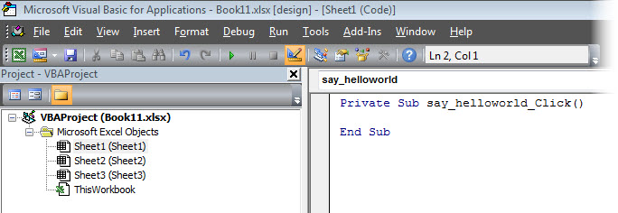
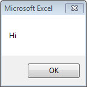

# VBA Excel宏 - VBA教程

## Excel VBA宏

在这一章中，让我们了解如何编写一个简单的宏。让我们一步一步来。

**第1步：**首先，让我们能够在Excel20XX'开发'菜单。做同样的，点击 File &gt;&gt; Option。

**第2步：**点击自定义功能区选项卡，并选中“Developer”，然后点击“OK”。



**第3步：**在“Developer”带状出现在菜单栏。



**第4步：**点击“Visual Basic”按钮以打开VBA编辑器。


**第5步：**现在，让我们通过添加一个按钮，启动脚本。点击“Insert”&gt;&gt;选择“button”。



**第6步：**执行右键单击并选择“properties”。



**第7步.** 编辑名称和标题如下所示。



**第8步：**现在，双击该按钮，如下图所示的子过程的轮廓将被显示。



**第9步：**让我们先来简单地增加一个报文编码。

```
Private Sub say_helloworld_Click()
    MsgBox "Hi"
End Sub

```

**第10步：**现在，可以点击按钮执行子过程。子过程的输出如下所示。我们将会示范进一步章节使用一个简单的按钮，从步骤＃1-10已说明到。因此，彻底理解本章对以后内容的学习是很重要的。



