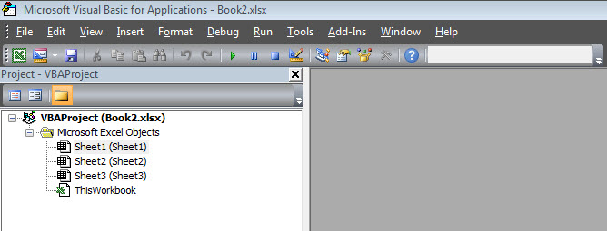
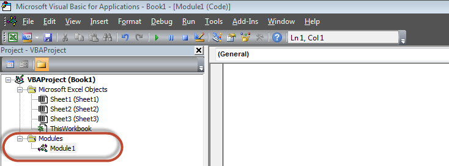
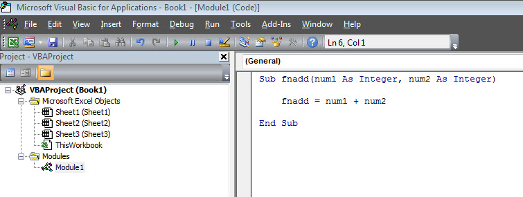

# Excel VBA术语 - VBA教程

## Excel VBA名词术语

在这一章中，让我们了解常用的Excel VBA术语。这些术语将在进一步模块学习中使用，因此理解它们是非常关键的。

### 模块

1.模块是其中代码被写入的区域。这是一个新的工作簿，因此不会有任何模块。

2.要插入导航模块Insert &gt;&gt; Module。一旦模块被插入“module1”创建。在该模块中，我们可以编写VBA代码和代码编写过程。程序/Sub过程是一系列的VBA语句指示怎么做。

### 过程

过程组被作为一个整体，指示Excel中如何执行特定任务执行的语句。执行的任务可以非常简单或非常复杂的，这是一个很好的做法，把程序分成较小的部分。

两种主要类型的过程分别是：Sub和Function。

### 函数

函数是一组可重用的代码，可以在程序的任何地方调用。这消除了一遍又一遍写相同的代码的需要。这将会使程序员能够将一个大程序分成若干小的，可管理的函数功能。

除了内置函数，VBA允许我们编写用户定义的函数，以及和语句都应写Function和End Function之间

### Sub过程

子程序的工作类似函数，Sub过程一般无返回值，函数可能会或可能不会返回一个值。 Sub过程可以不调用关键字。子过程总是使用Sub和End Sub语句括起来。

