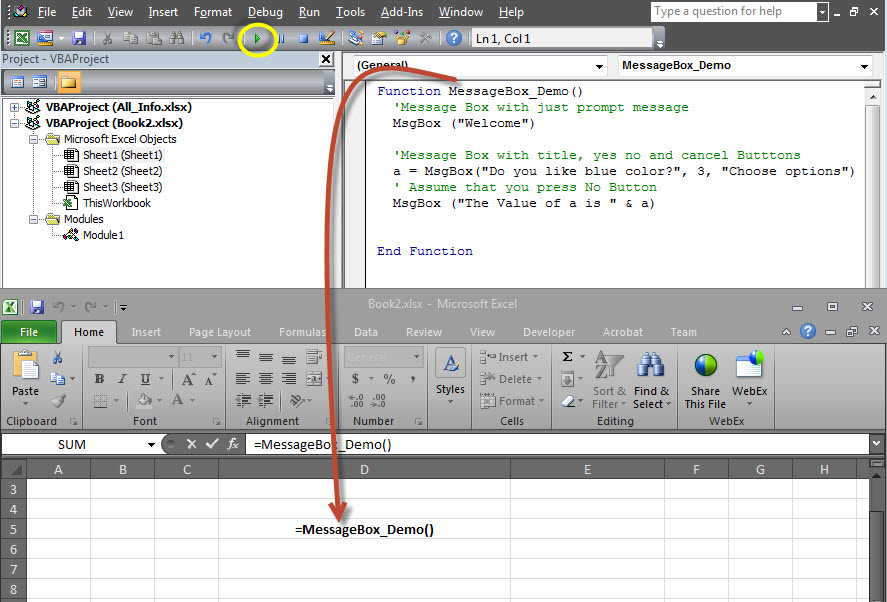
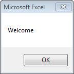
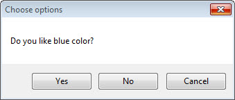
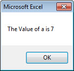

# VBA消息框 - VBA教程

## VBA消息框

MsgBox函数显示一个消息框，并等待用户点击一个按钮，然后根据用户点击该按钮的动作执行。

## 语法

```
MsgBox(prompt[,buttons][,title][,helpfile,context])
```

## 参数说明

*   Prompt - 必需的参数。这显示在对话框中的消息的字符串。 prompt 最大长度大约是1024个字符。如果消息扩展到多行，那么可以单独使用回车符(CHR(13))或每行之间的换行符(CHR(10))。

*   buttons - 一个可选的参数。数值表达式，用于指定按钮的类型来显示，图标样式使用，默认按钮的标识以及消息框的样式。如果留空，对于按钮的默认值是0。

*   Title - 一个可选的参数。在对话框的标题栏中显示的字符串表达式。如果标题为空，应用程序的名称被放置在此标题栏中。

*   helpfile - 一个可选的参数。标识帮助文件中的字符串表达式使用提供的对话框中的上下文相关帮助。

*   context - 一个可选的参数。数值表达式，用于标识由帮助文件的作者指定给适当的帮助主题的上下文编号。如果上下文中提供帮助文件，此项还必须提供。

按钮参数可以采用任何的下列值：

*   0 vbOKOnly只显示OK按钮。

*   1 vbOKCancel显示确定和取消按钮。

*   2 vbAbortRetryIgnore显示放弃，重试和忽略按钮。

*   3 vbYesNoCancel Displays Yes, No, and Cancel buttons.

*   4 vbYesNoCancel显示是，否和取消按钮。

*   5 vbRetryCancel显示重试和取消按钮。

*   16 vbCritical显示关键信息的图标。

*   32 vbQuestion显示警告查询图标。

*   48 vbExclamation显示一条警告信息图标。

*   64 vbInformation显示信息消息图标。

*   0 vbDefaultButton1第一个按钮是默认的。

*   256 vbDefaultButton2第二个按钮是默认的。

*   512 vbDefaultButton3第三个按钮是默认的。

*   768 vbDefaultButton4第四个按钮是默认的。

*   0 vbApplicationModal应用模式。当前应用程序将无法正常工作，直到用户响应消息框。

*   4096 vbSystemModal系统模式。所有的应用程序将无法正常工作，直到用户响应消息框。

上面的值是逻辑上划分为四组：第一组(0-5)表示按钮被显示在消息框中。第二组(16，32，48，64)描述的图标的sytle要被显示，第三组(0，256，512，768)指示哪些键必须是缺省值，第四组值(0，4096 )确定该消息框的样式。

### 返回值

MsgBox函数可以返回使用，我们将能够识别此按钮，用户在消息框中单击了下列值之一。

*   1 - vbOK - "确定"被点击

*   2 - vbCancel - "取消"被点击

*   3 - vbAbort - "中止"被点击

*   4 - vbRetry - "重试"被点击

*   5 - vbIgnore - "忽略"被点击

*   6 - vbYes - "是"被点击

*   7 - vbNo - "否"被点击

## 例子

```

Function MessageBox_Demo()
  'Message Box with just prompt message
  MsgBox("Welcome")    

  'Message Box with title, yes no and cancel Butttons 
  a = MsgBox("Do you like blue color?",3,"Choose options")
  ' Assume that you press No Button	
  msgbox ("The Value of a is " & a)
End Function
```

## 输出

1.上述功能可以通过点击VBA窗口“运行”按钮，或通过调用Excel工作表函数，如下图所示执行。



2.一个简单的消息框将显示一条消息，“Welcome”和“OK”按钮：



3.单击确定后，另一个对话框将显示一条消息，“yes, no, 和 cancel”按钮。



4.单击取消按钮键的值之后（7）被存储为一个整数，如下所示显示消息框给用户。使用该值，我们就能够知道哪个按钮用户点击。



