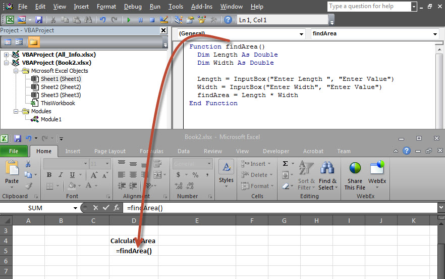
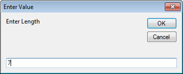
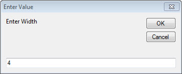
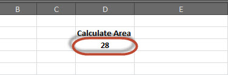

# VBA输入框 - VBA教程

## 什么是输入框？

InputBox函数帮助用户从用户得到值。输入值时，如果用户点击OK按钮或键盘上按下ENTER后，InputBox函数将返回在文本框中的文本。如果用户点击取消按钮，该函数会返回一个空字符串(“”)。

## 语法

```
InputBox(prompt[,title][,default][,xpos][,ypos][,helpfile,context])
```

## 参数说明：

*   Prompt - 必需的参数。这显示在对话框中的消息的字符串。 prompt 最大长度大约是1024个字符。如果消息扩展到多行，那么可以单独使用回车符(CHR(13))或每行之间的换行符(CHR(10))。

*   Title - 一个可选的参数。在对话框的标题栏中显示的字符串表达式。如果标题为空，应用程序的名称被放置在标题栏中。

*   Default - 一个可选的参数。显示在文本框中的默认文本

*   XPos - 一个可选的参数。X轴的位置，表示从屏幕的左侧水平提示距离。如果留空，输入框水平居中。

*   YPos - 一个可选的参数。Y轴的位置，表示从画面垂直方向的左侧的提示距离。如果留空，输入框垂直居中。

*   helpfile - 一个可选的参数。标识帮助文件中的字符串表达式使用提供的对话框中的上下文相关帮助。

*   context - 一个可选的参数。数值表达式，用于标识由帮助文件的作者指定给适当的帮助主题的上下文编号。如果上下文中提供的，帮助文件还必须提供。

## 例子

我们将通过从用户获得的值在运行时用的两个输入框(一个长度和一个用于宽度)的帮助下计算的矩形的面积

```
Function findArea()
  Dim Length As Double
  Dim Width As Double

  Length = InputBox("Enter Length ", "Enter a Number")
  Width = InputBox("Enter Width", "Enter a Number")
  findArea = Length * Width
End Function
```

## 输出

1.执行相同，我们需要调用使用函数名，然后按下面输入如图所示。



2.在执行时，第一个输入框(长度)的显示和用户输入一个值在输入框中。



3.进入的第一个值之后，第二输入框(宽度)被显示给用户。



4.在进入第二数量并点击OK按钮，该区域被显示给用户，如下所示。



