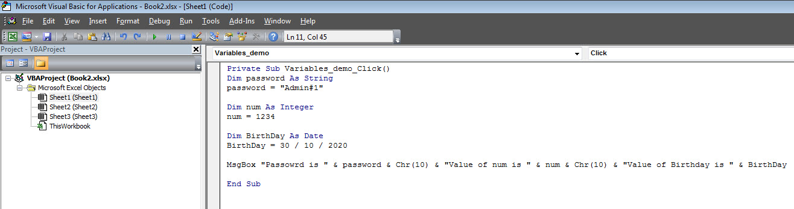
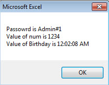

# VBA变量 - VBA教程

变量是用来存放可以在脚本执行过程中改变的值命名的存储位置。下面是命名变量的基本规则。下面所列的是用于命名一个变量的规则。

*   必须使用一个字母作为第一个字符。

*   不能使用空格，句号(.)，感叹号(!)，或字符@, &, $, #在变量名称中。

*   名称不能超过255个字符。

*   不能使用Visual Basic保留关键字作为变量名。

## 语法

在VBA中，我们需要在使用之前声明变量。

```
Dim <<variable_name>> As <<variable_type>>
```

## 数据类型

有许多的VBA的数据类型，它可以非常分为两大类，即数字和非数字数据类型。

### 数字数据类型

下表显示的数值数据类型和值的允许范围。

| 类型 | 值范围 |
| --- | --- |
| Byte | 0 - 255 |
| Integer | -32,768 - 32,767 |
| Long | -2,147,483,648 - 2,147,483,648 |
| Single | -3.402823E+38 ~ -1.401298E-45 为负值
1.401298E-45 ~  3.402823E+38 为正值 |
| Double | -1.79769313486232e+308 ~ -4.94065645841247E-324 为负值
4.94065645841247E-324 ~ 1.79769313486232e+308 为正值 |
| Currency | -922,337,203,685,477.5808 to 922,337,203,685,477.5807 |
| Decimal | +/- 79,228,162,514,264,337,593,543,950,335 if no decimal is use 
+/- 7.9228162514264337593543950335 (28 decimal places). |

### 非数字数据类型

下表显示了非数值数据类型和值的允许范围。

| 类型 | 值范围 |
| --- | --- |
| String(fixed length) | 1 ~ 65,400 字符 |
| String(variable length) | 0 ~ 2 十亿个字符 |
| Date | 1月 1, 100 到12月 31, 9999 |
| Boolean | True 或False |
| Object | 任何嵌入对象 |
| Variant(numeric) | 任何Double值一样大 |
| Variant(text) | 同为可变长度的字符串 |

## 例子

我们创建一个按钮，并将其命名为“Variables_demo”用来演示使用变量。



```
Private Sub Variables_demo_Click()
 Dim password As String
 password = "Admin#1"

 Dim num As Integer
 num = 1234

 Dim BirthDay As Date
 BirthDay = 30 / 10 / 2020

 MsgBox "Passowrd is " & password & Chr(10) & "Value of num is " & num & Chr(10) & "Value of Birthday is " & BirthDay

End Sub
```

## 输出

时执行该脚本，则输出将如下所示。



