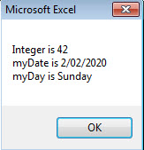

# VBA常量 - VBA教程

常量是用来存放那些不能在脚本执行期间更改的值命名的存储位置。如果用户试图更改一个恒定值，该脚本执行出现一个错误并结束。常量声明的方式和变量声明相同。

下面是用于命名一个常量的规则。

*   必须使用一个字母作为第一个字符。

*   不能使用空格，句号(.)，感叹号(!)，或字符@, &, $, #在名称中。

*   名称不能超过255个字符。

*   不能使用Visual Basic保留关键字作为变量名。

## 语法

在VBA中，我们需要的值赋给声明的常量。如果我们试着改变常量的值错误会被抛出。

```
Const <<constant_name>> As <<constant_type>> = <<constant_value>>

```

## 例子

我们将创建一个按钮“Constant_demo”来演示如何使用常数。

```
Private Sub Constant_demo_Click()
  Const MyInteger As Integer = 42
  Const myDate As Date = #2/2/2020#
  Const myDay As String = "Sunday"

  MsgBox "Integer is " & MyInteger & Chr(10) & "myDate is " & myDate & Chr(10) & "myDay is " & myDay

End Sub

```

## 输出

在执行该脚本，如下所示，输出将被显示。



