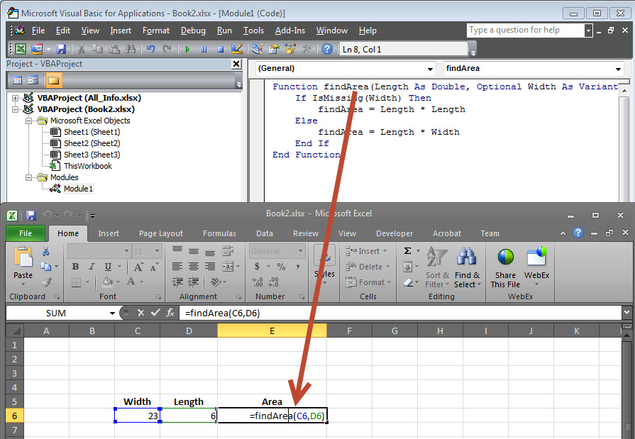

# VBA定义函数 - VBA教程

## 什么是函数？

函数是一组可重用的代码，可以在程序的任何地方被调用。这消除了一遍又一遍写相同的代码的需要。这将使程序员将一个大程序分成若干小且易于管理的功能。

除了内置的功能，VBA允许我们编写的用户定义函数也是如此。本节将介绍如何编写在VBA中自己定义的函数。

## 函数定义

VBA函数可以有一个可选的return语句。如果想从一个函数返回一个值这是必需的。

例如，可以通过两个数字在一个函数，那么可以从函数希望返回在调用程序乘法。

注：函数可以返回由逗号作为分配给函数名本身就是一个数组分隔的多个值。

在我们使用一个函数之前，我们需要先定义特定函数。在VBA中定义函数的最常见的方法是通过使用 Function 关键字，随后是唯一的函数名称，并将其可以或可以不携带的参数的列表，并与一个 End Function 关键字结束，这表明该函数结束声明。基本语法如下所示：

## 语法

添加一个按钮，并添加以下功能

```
Function Functionname(parameter-list)
  statement 1
  statement 2
  statement 3
  .......
  statement n
End Function
```

## 例子

添加以下函数返回面积。需要注意的是一个值/值可以连同函数名本身被返回。

```
Function findArea(Length As Double, Optional Width As Variant)
    If IsMissing(Width) Then
        findArea = Length * Length
    Else
        findArea = Length * Width
    End If
End Function
```

## 调用函数

调用一个函数，调用使用函数名称，如下所示：



