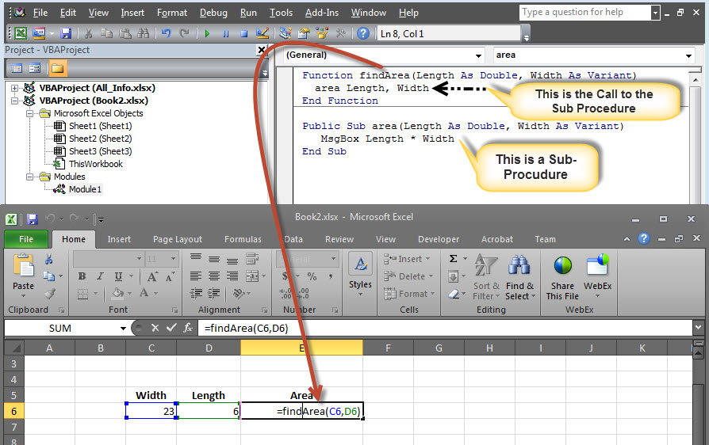
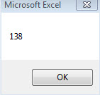
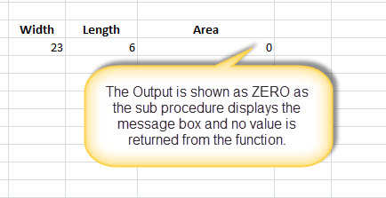

# VBA子过程 - VBA教程

## 子过程

Sub过程类似函数，但也有一些差别。

*   子过程没有返回值，同时函数可能会或可能不会返回值。

*   子过程调用可以不用关键字。

*   子过程总是在Sub和End Sub语句之间括起来部分。

## 例子 :

```
Sub Area(x As Double, y As Double)
	MsgBox x * y
End Sub

```

## 调用过程：

在脚本的某处调用程序，可以从一个函数调用。但不能够使用相同的方式，一个功能的子过程是没有返回值的。

```
Function findArea(Length As Double, Width As Variant)
    area Length, Width    ' To Calculate Area 'area' sub proc is called
End Function

```

1.现在可以调用函数只而不是子过程，如下图所示。



2.面积计算，仅在消息框中显示。



3.结果单元格显示为零面积值不是从函数返回。总之，不能直接从Excel工作表调用一个子过程。



