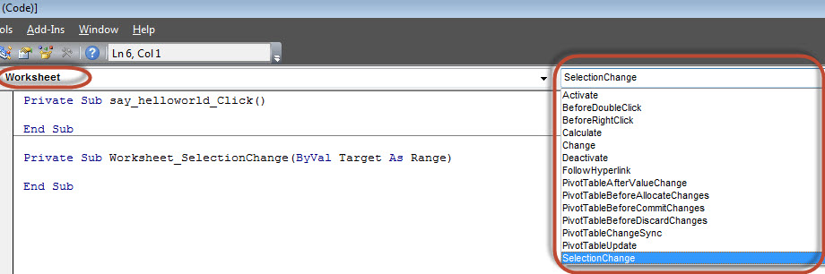
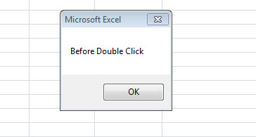
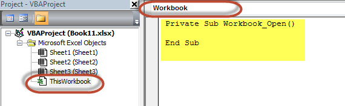
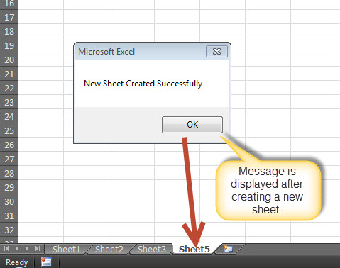

# VBA事件 - VBA教程

## VBA 事件

VBA，事件驱动编程时可以手动更改单元格值的单元格或单元格区域被触发。更改事件可能会使事情变得更容易，但可以很快结束了一个完全格式化的页面。有两种类型的事件。

*   工作表事件

*   工作簿活动

## 工作表事件

工作表事件被触发时，在工作表中有变化。表标签上执行右键单击，选择“view code”，然后粘贴代码创建的。

用户可以选择那些工作表中的每一个，并从下拉列表中选择“工作表”下去把所有支持工作表的事件列表。



下面是可以由用户添加的支持工作表的事件。

```
Private Sub Worksheet_Activate() 
Private Sub Worksheet_BeforeDoubleClick(ByVal Target As Range, Cancel As Boolean)    
Private Sub Worksheet_BeforeRightClick(ByVal Target As Range, Cancel As Boolean) 
Private Sub Worksheet_Calculate() 
Private Sub Worksheet_Change(ByVal Target As Range) 
Private Sub Worksheet_Deactivate() 
Private Sub Worksheet_FollowHyperlink(ByVal Target As Hyperlink) 
Private Sub Worksheet_SelectionChange(ByVal Target As Range)

```

### 例子

只需要前双击显示一条消息。

```
Private Sub Worksheet_BeforeDoubleClick(ByVal Target As Range, Cancel As Boolean)
    MsgBox "Before Double Click"
End Sub

```

### 输出

当双击任意单元格，显示消息框给用户，如下所示。



## 工作簿活动

工作簿事件被触发时，有一个变化以对整个工作簿。可以通过选择“ThisWorkbook'和选择从下拉'workbook'，如下所示添加为工作簿的事件的代码。立即 Workbook_open 子过程显示给用户，如下所示。



下面是可以由用户添加的支持工作薄的事件。

```
Private Sub Workbook_AddinUninstall() 
Private Sub Workbook_BeforeClose(Cancel As Boolean) 
Private Sub Workbook_BeforePrint(Cancel As Boolean) 
Private Sub Workbook_BeforeSave(ByVal SaveAsUI As Boolean, Cancel As Boolean) 
Private Sub Workbook_Deactivate() 
Private Sub Workbook_NewSheet(ByVal Sh As Object) 
Private Sub Workbook_Open() 
Private Sub Workbook_SheetActivate(ByVal Sh As Object) 
Private Sub Workbook_SheetBeforeDoubleClick(ByVal Sh As Object, ByVal Target As Range, Cancel As Boolean) 
Private Sub Workbook_SheetBeforeRightClick(ByVal Sh As Object, ByVal Target As Range, Cancel As Boolean) 
Private Sub Workbook_SheetCalculate(ByVal Sh As Object) 
Private Sub Workbook_SheetChange(ByVal Sh As Object, ByVal Target As Range) 
Private Sub Workbook_SheetDeactivate(ByVal Sh As Object) 
Private Sub Workbook_SheetFollowHyperlink(ByVal Sh As Object, ByVal Target As Hyperlink) 
Private Sub Workbook_SheetSelectionChange(ByVal Sh As Object, ByVal Target As Range) 
Private Sub Workbook_WindowActivate(ByVal Wn As Window) 
Private Sub Workbook_WindowDeactivate(ByVal Wn As Window) 
Private Sub Workbook_WindowResize(ByVal Wn As Window)

```

### 例子

只需要显示一条消息，一个新的工作表被成功创建，每当一个新表是创建的用户。

```
Private Sub Workbook_NewSheet(ByVal Sh As Object)
    MsgBox "New Sheet Created Successfully"
End Sub

```

### 输出

创建一个新的 Excel工作表的消息显示给用户，如下所示。



