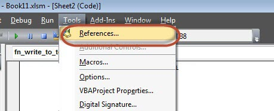
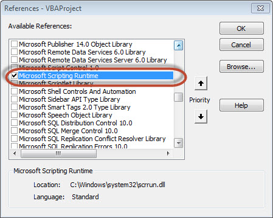
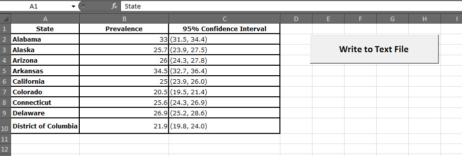
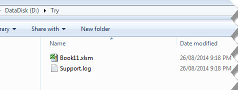
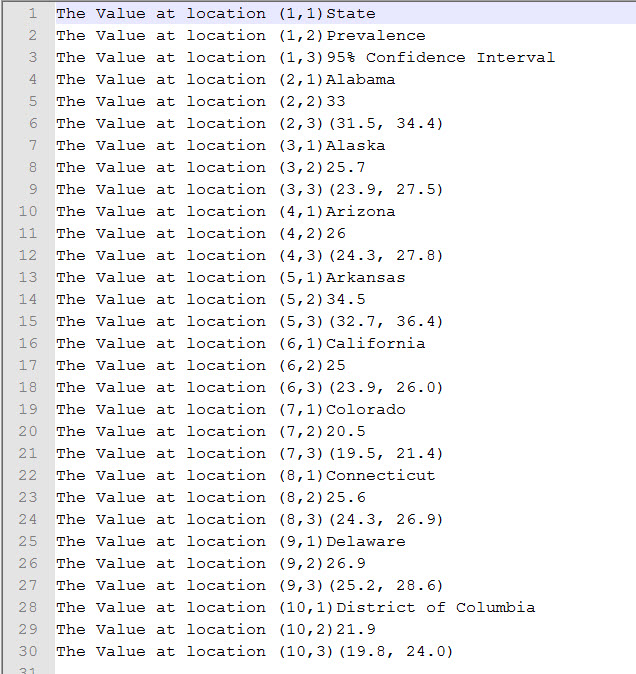
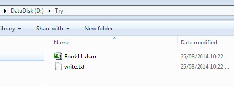

# VBA文本文件 - VBA教程

## VBA文本文件

我们可以读取Excel文件，并写入单元格中的内容到一个文本文件。这样一来，VBA允许用户使用文本文件的工作。我们可以测试文件使用工作的两种方法

*   文件系统对象

*   使用Write命令

## 使用文件系统对象(FSO)

正如其名称所说的，FSO对象帮助开发者使用驱动器，文件夹和文件的工作。在本节中，我们将讨论如何使用FSO。

| 对象类型 | 描述 |
| --- | --- |
| Drive | 驱动器是一个对象。包含的方法和属性，收集关于连接到系统的驱动器的信息 |
| Drives | 硬盘是一个集合。它提供了连接到系统，无论是物理或逻辑的驱动器的列表。 |
| File | 文件是一个对象。它包含的方法和属性，使开发人员能够创建，删除或移动文件。 |
| Files | 文件是一个集合。它提供了包含在文件夹内的所有文件的列表。 |
| Folder | 文件夹是一个对象。它提供的方法和属性，使开发人员能够创建，删除或移动文件夹。 |
| Folders | 文件夹是一个集合。它提供了一个文件夹内的所有文件夹列表。 |
| TextStream | 文本流是一个对象。它使开发人员能够读取和写入文本文件。 |

### 驱动器

Drive是一个对象，它提供了访问特定的磁盘驱动器或网络共享的属性。以下属性是由驱动器对象支持：

*   AvailableSpace

*   DriveLetter

*   DriveType

*   FileSystem

*   FreeSpace

*   IsReady

*   Path

*   RootFolder

*   SerialNumber

*   ShareName

*   TotalSize

*   VolumeName

### 例子

第1步：在继续使用FSO脚本，我们应该使Microsoft脚本运行。做同样，导航到"Tools" &gt;&gt; "References" ，如下图所示：



第2步：添加“Microsoft Scripting RunTime”，然后单击确定。



第3步：添加数据，将它写入一个文本文件，并添加一个命令按钮。



第4步：现在是写脚本的时候。

```
Private Sub fn_write_to_text_Click()
  Dim FilePath As String
  Dim CellData As String
  Dim LastCol As Long
  Dim LastRow As Long

  Dim fso As FileSystemObject
  Set fso = New FileSystemObject
  Dim stream As TextStream

  LastCol = ActiveSheet.UsedRange.Columns.Count
  LastRow = ActiveSheet.UsedRange.Rows.Count

  ' Create a TextStream.
  Set stream = fso.OpenTextFile("D:\Try\Support.log", ForWriting, True)

  CellData = ""

  For i = 1 To LastRow
      For j = 1 To LastCol
      CellData = Trim(ActiveCell(i, j).Value)
      stream.WriteLine "The Value at location (" & i & "," & j & ")" & CellData
      Next j
  Next i

  stream.Close
  MsgBox ("Job Done")
End Sub
```

### 输入

当执行脚本，请确保将光标放在工作表的第一个单元格。如在下面创建Support.log文件 "D:\Try"：



该文件的内容也被显示如下：



## 使用写命令

不像FSO，我们不需要添加任何引用，但是不能够正常工作的驱动器，文件和文件夹。能够只流添加到文本文件中。

### 例子

```
Private Sub fn_write_to_text_Click()
  Dim FilePath As String
  Dim CellData As String
  Dim LastCol As Long
  Dim LastRow As Long

  LastCol = ActiveSheet.UsedRange.Columns.Count
  LastRow = ActiveSheet.UsedRange.Rows.Count

  FilePath = "D:\Try\write.txt"
  Open FilePath For Output As #2

  CellData = ""
  For i = 1 To LastRow
      For j = 1 To LastCol
      CellData = "The Value at location (" & i & "," & j & ")" & Trim(ActiveCell(i, j).Value)
      Write #2, CellData
      Next j
  Next i

  Close #2
  MsgBox ("Job Done")
End Sub
```

### 输出

如下图所示当执行脚本时，在“D:\Try”创建“write.txt”文件。



该文件的内容也被显示如下：


