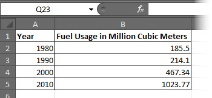
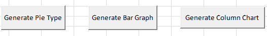
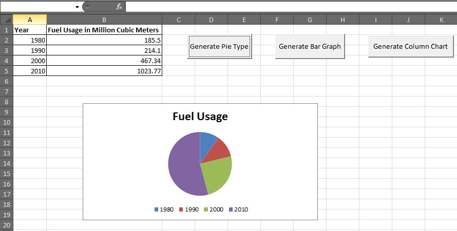

# VBA图表编程 - VBA教程

## VBA - 图表编程

使用VBA，就可以做到生成基于一定的标准图表。让我们来看看它的一个例子。

**步骤1：**首先输入针对图表有生成的数据。



**第2步：**让我们创建3个按钮中的一个来生成柱状图，饼图，柱形图。



**第3步：**现在让我们建立一个宏来生成这些类型的每一个图表

```
' Procedure to Generate Pie Chart
Private Sub fn_generate_pie_graph_Click()
    Dim cht As ChartObject
    For Each cht In Worksheets(1).ChartObjects
        cht.Chart.Type = xlPie
    Next cht
End Sub

' Procedure to Generate Bar Graph
Private Sub fn_Generate_Bar_Graph_Click()
    Dim cht As ChartObject
    For Each cht In Worksheets(1).ChartObjects
        cht.Chart.Type = xlBar
    Next cht
End Sub

' Procedure to Generate Column Graph
Private Sub fn_generate_column_graph_Click()
    Dim cht As ChartObject
    For Each cht In Worksheets(1).ChartObjects
        cht.Chart.Type = xlColumn
    Next cht
End Sub
```

**步骤4：**在点击相应的按钮，创建的图表。在下面的输出，我们点击生成饼图按钮。



