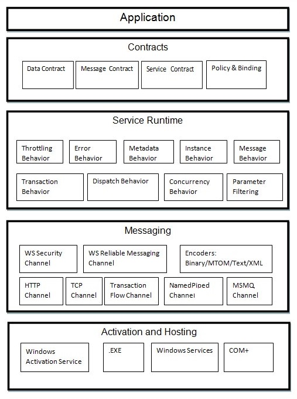

# WCF架构 - WCF教程

WCF是一个分层架构，为开发各种分布式应用的充分支持。该体系结构在下面将详细说明。

## 约定

约定层旁边就是应用层，并含有类似于现实世界的约定，指定服务和什么样的信息可以访问它会使操作的信息。约定基本都是在简短的讨论如下四种类型。

*   **Service contract** - 约定规定，在沟通过程中使用的信息给客户端，以及对终端的产品和协议的外部世界。

*   **Data contract** - 由服务交换的数据是由一个数据契约定义。客户端和服务需要在与数据合同协议。

*   **Message Contract** - 数据合同由约定信息控制。它主要是SOAP消息的参数类型格式的定制。在此，应该提到的是WCF采用SOAP格式进行通信。 SOAP代表简单对象访问协议。

*   **Policy and Binding** - 由策略和有约束力的约定被定义为一个服务，这样的条件下通信的某些先决条件。客户端需要遵循这一约定。

## 服务运行时

服务运行时层仅仅是约定层之下。它指定在运行时出现的各种服务行为。有许多类型的行为，可以进行配置，如下的服务运行。

*   **Throttling Behavior** - 管理处理的消息的数量

*   **Error Behavior** – 定义任何内部服务错误发生的结果

*   **Metadata Behavior** – 指定的元数据的可用性到外界

*   **Instance Behavior** – 定义要创建需要的实例的数量，以使它们可用于在客户端

*   **Transaction Behavior** – 能够在事务状态的变化的情况下出现任何故障

*   **Dispatch Behavior** - 控制由该消息得到了WCF的基础处理方式

*   **Concurrency Behavior** - 控制的客户端 - 服务器通信过程中并行运行功能

*   **Parameter Filtering** - 功能参数的方法验证的过程，在它被调用之前

## 消息

这层几个通道构成主要涉及两个端点之间传送的消息的内容。一组通道的形成通道堆栈和构成的通道堆栈的下面那些渠道的两种主要类型。

*   **Transport Channels** - 这些通道都存在于栈底和负责发送和接收使用像HTTP，TCP，P2P，命名管道和MSMQ传输协议的消息。

*   **Protocol Channels** - 存在于堆栈的顶部，这些信道也被称为层状通道通过修改消息实现线级协议。

## 激活和托管

WCF的体系结构的最后一层是其中服务实际上是托管，或者可以以方便客户端被执行的地方。这是通过在下面简要讨论的各种机制进行。

*   **IIS** - 互联网信息服务的缩写提供使用HTTP协议通过服务优势很多。这里主机代码的要求不是强制性的，用于激活该服务代码，相反，服务码被自动激活。

*   **Windows激活服务** - 这就是俗称WAS和带有IIS7.0。 HTTP和非HTTP通信，可以在这里通过使用TCP或Namedpipe协议。

*   **Self-Hosting** - 这是由一个WCF服务获取自托管的控制台应用程序的机制。这种机制提供了惊人的灵活选择所需的协议和设置自己的解决方案方面。

*   **Windows Service** - 主持这一机制的WCF服务是有利的，因为该服务保持激活状态，并接触到客户端，由于没有运行时激活。

