# 创建WCF服务 - WCF教程

使用Microsoft Visual Studio2012创建WCF服务，理解如下所有必要的编码，更好地创建WCF服务的概念，这里做一个简单的任务。

*   启动Visual Studio 2012。

*   单击新建项目，然后在Visual C＃标签，选择WCF选项。

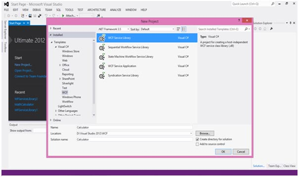

WCF服务创建，执行如加法，减法，乘法和除法基本的算术运算。主要的代码是在两个不同的文件 - 一个接口和一个类。

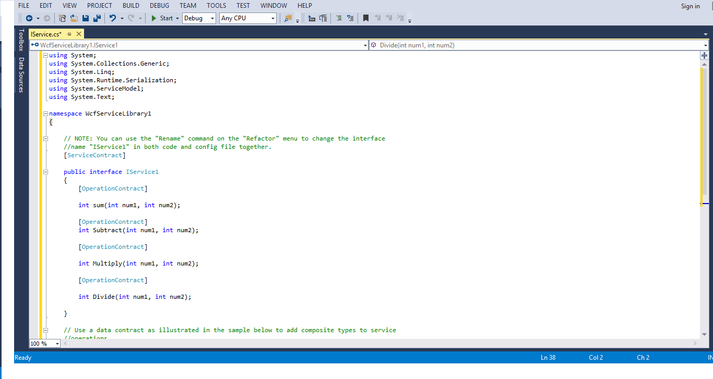

一个WCF中包含一个或多个接口和实现类。

```

using System;
using System.Collections.Generic;
using System.Linq;
using System.Runtime.Serialization;
using System.ServiceModel;
using System.Text;

namespace WcfServiceLibrary1
{
   //NOTE: You can use the "Rename" command on the "Refactor" menu to change the  
   //interface name "IService1" in both code and config file together.
   [ServiceContract]
   Public interface IService1
   {
      [OperationContract]
      int sum(int num1, int num2);

      [OperationContract]
      int Subtract(int num1, int num2);

      [OperationContract]
      int Multiply(int num1, int num2);

      [OperationContract]
      int Divide(int num1, int num2);
   }

   //Use a data contract as illustrated in the sample below to add composite types 
   //to service operations.
   [DataContract]
   Public class CompositeType
   {
      Bool boolValue = true;
      String stringValue = "Hello ";

      [DataMember]
      Public bool BoolValue
      {
         get { return boolValue; }
         set { boolValue = value; }
      }

      [DataMember]

      Public string StringValue
      {
        get { return stringValue; }
        set { stringValue = value; }
      }
   }
}
```

而其后面是类的代码，

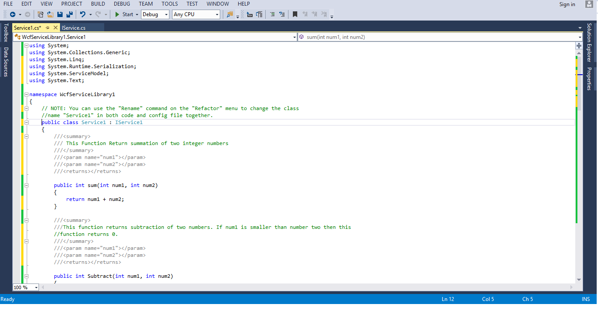

```
using System;
usingSystem.Collections.Generic;
usingSystem.Linq;
usingSystem.Runtime.Serialization;
usingSystem.ServiceModel;
usingSystem.Text;

namespace WcfServiceLibrary1
{
   //NOTE: You can use the "Rename" command on the "Refactor" menu to change the 
   //class name "Service1" in both code and config file together.

   publicclassService1 :IService1
   {
      /// This Function Return summation of two integer numbers

      publicint sum(int num1, int num2)
      {
         return num1 + num2;
      }
      ///This function returns subtraction of two numbers. 
      ///If num1 is smaller than number two then this function returns 0.

      publicint Subtract(int num1, int num2)
      {
         if (num1 > num2)
         {
            return num1 - num2;
         }
         else
         {
            return 0;
         }
      }
      ///This function returns multiplication of two integer numbers.

      publicint Multiply(int num1, int num2)
      {
         return num1 * num2;
      }
      ///This function returns integer value of two integer number. 
      ///If num2 is 0 then this function returns 1.

      publicintDivide(int num1, int num2)
      {
         if (num2 != 0)
         {
            return (num1 / num2);
         }
         else
         {
            return 1;
         }
      }
   }
}
```

要运行此服务，请在Visual Studio中点击开始按钮。

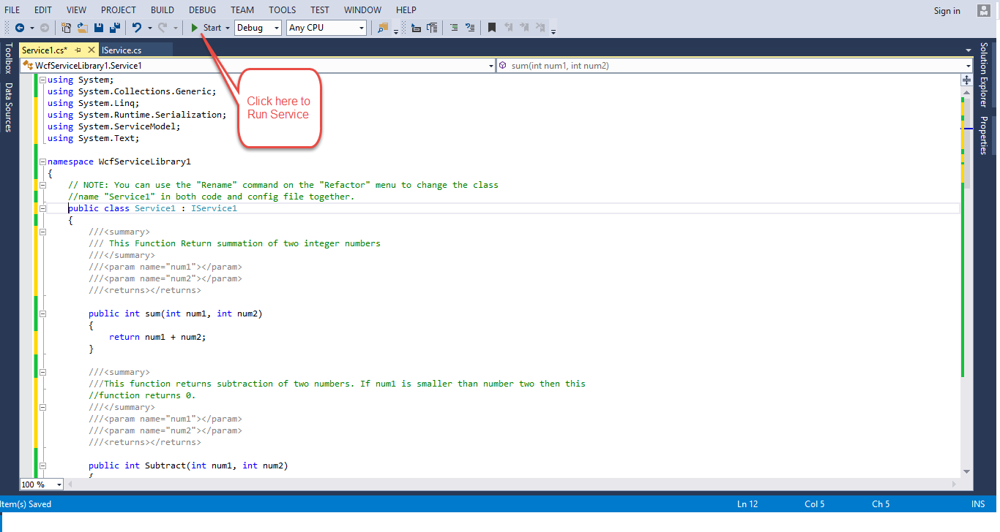

当我们运行这个服务，下面的屏幕会出现。

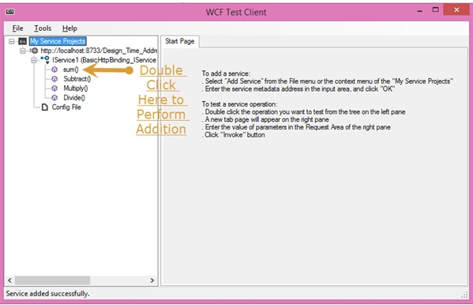

上点击sum方法，在下面的页面将被打开。在这里，可以输入任何两个整数，然后单击Invoke按钮。该服务将返回这两个数字的总和。

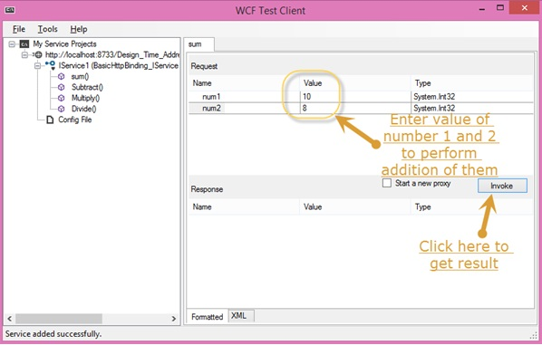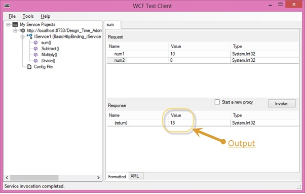

像求和，我们可以执行哪个都列在菜单中的所有算术运算。这里是捕捉他们。

当点击下页将出现在Sutbtarct方法。输入整数，点击调用按钮，得到的输出如下所示。

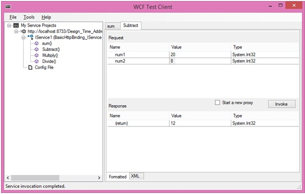

下页将出现在Multiply方法单击时。输入整数，点击调用按钮，得到的输出如下所示。

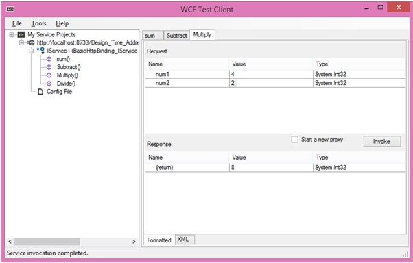

下面的页面上会出现当点击Divide方法时。输入整数，点击调用按钮，得到的输出如下所示。

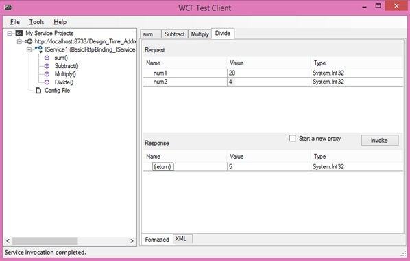

一旦服务被调用，可以在它们之间，直接从这里切换。

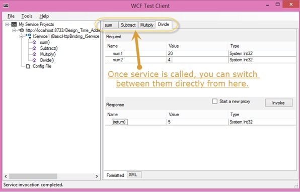

