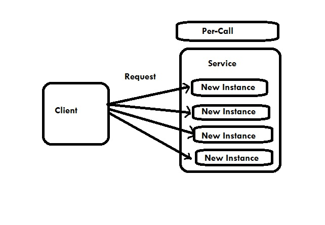

# WCF实例管理 - WCF教程

这组由Windows通讯基础(WCF)结合一组消息(客户端请求)服务实例所采用的技术被称为实例管理。一个完全由三种类型实例激活支持WCF，它们如下所述。

## 1.每个调用服务

每次调用服务是Windows通讯基础的默认实例激活模式。当一个WCF服务配置为每个调用服务，一个CLR对象是时间跨度客户调用或请求进行创建。 CLR代表公共语言运行库，并在WCF服务实例。

在每个调用服务，每一个客户端请求实现专用消耗相同的内存并且新的服务实例较少，相较于其他类型的实例激活。必需有InstanceContextMode属性，以指示WCF服务以充当每次调用服务被设置为InstanceContextMode.PerCall。InstanceContextMode属性属于ServiceBehavior属性。

因此，每调用服务可以被配置为

```
[ServiceContract]
interface IMyContract
{...}
[ServiceBehavior (InstanceContextMode = InstanceContextMode.PerCall)]
class MyService : IMyContract
{...} 
```

服务在这里表示为IMyContract。

每次调用服务实例激活的过程可以描述如下图。

<center>

## 实现每个调用服务

```
[DataContract]
  class Param {....}
  [ServiceContract]
  interface IMyContract
  {
     [OperationContract]
     void MyMethod(Param objectIdentifier);
  }
  class MyPerCallService : IMyContract, IDisposable
  {
     public void MyMethod(Param objectIdentifier)
     {
        GetState(objectIdentifier); 
        DoWork();
        SaveState(objectIdentifier);
     }
     void GetState(Param objectIdentifier) {....}
     void DoWork() {....}
     void SaveState(Param objectIdentifier) {....}
     public void Dispose() {....}
  }
```

这里，参数是用于创建对上述实施例的模拟类型的参数。

## 2.每个调用服务

在此激活WCF模式，私有或者我们可以说这是一个保密的会话保持两个实体，即客户端和特定的服务实例。也被称为私有会话服务，该模式提供了其始终致力于为每一个客户要求和自主各有关该会话感知服务的其他情况下的一个新的服务实例。

InstanceContextMode属性需要设置为PerSession发起这个每会话服务。在这里，服务实例保留在内存中全部通过会话持续时间。从可扩展性的激活模式受到所配置的服务是不是能够支持任何额外出色的客户比其他几个或可能达到一些，因为涉及的每一个专用服务实例的成本。

因此，每个会话服务可以被配置为

```
[ServiceBehavior (InstanceContextMode = InstanceContextMode.PerSession)]
class MyService : IMyContract
{...}
```

每个会话服务的过程可以被描述为下面的图。

<center>

下面的代码显示了配置为私有会话的使用合约和服务。输出表示该客户端确实有一个专门的服务实例。

服务代码

```
[ServiceContract(Session = true)]
  interface IMyContract
  {
     [OperationContract]
     void MyMethod();
  }
  [ServiceBehavior(InstanceContextMode = InstanceContextMode.PerSession)]
  class MyService : IMyContract, IDisposable
  {
     int m_Counter = 0; MyService() { Console.WriteLine("MyService.MyService()"); }
     public void MyMethod()
     {
        m_Counter++;
        Console.WriteLine("Counter = " + m_Counter);
     }
     public void Dispose() 
     { 
        Console.WriteLine("MyService.Dispose()"); 
     }
  }
```

客户端代码

```
MyContractProxy proxy = new MyContractProxy(); proxy.MyMethod(); proxy.MyMethod(); 
proxy.Close();
```

输出

```
MyService.MyService() Counter = 1 Counter = 2 MyService.Dispose()	
```

## 3.单例服务

在此活化的WCF模式下，所有客户端请求独立于彼此，它们到服务端点的连接会连接到相同的单实例。只有当主机关机那么单例服务得不到处理。

这项服务是刚刚创建创建主机时。在这种情况下，主机不提供任何单一实例，该服务将返回为NULL。激活模式是最好的时候，每个方法调用的工作量少，无等待的操作后台有没有在运行。

InstanceContextMode属性需要设置为InstanceContextMode.Single启动这一单例服务。

因此，一个单例服务可以被配置为

```
[ServiceBehavior(InstanceContextMode = InstanceContextMode.Single)]
class MySingleton : ...
{...}
```

单例服务的过程可以被描述如下图所示。


## 单例代码实例的初始化和托管

服务代码

```
[ServiceContract]
interface IMyContract
{
  [OperationContract]
  void MyMethod( );
}
[ServiceBehavior(InstanceContextMode = InstanceContextMode.Single)]
class MySingleton : IMyContract
{
  int m_Counter = 0;
  public int Counter
  {
     get
     {
        return m_Counter;
     }
     set
     {
        m_Counter = value;
     }
  }
  public void MyMethod( )
  {
     m_Counter++;
     Trace.WriteLine("Counter = " + Counter);
  }
}
```

主机代码

```
MySingleton singleton = new MySingleton( );
singleton.Counter = 42;

ServiceHost host = new ServiceHost(singleton);
host.Open( );
//Do some blocking calls then
host.Close( );
```

客户端代码

```
MyContractClient proxy = new MyContractClient( );
proxy.MyMethod( );
proxy.Close( );
```

输出

```
Counter = 43
```

