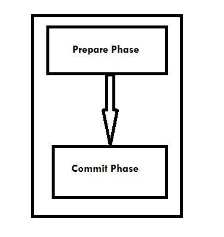
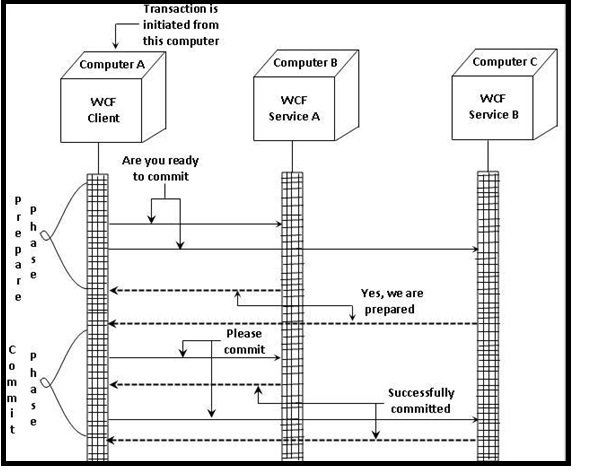
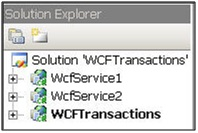
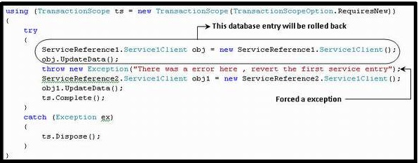

# WCF事务 - WCF教程

事务处理在WCF(Windows Communication Foundation)是一套遵循一些性质，统称为ACID的操作。这里，如果一个操作出现故障，整个系统就会自动失败。如网上订单生成，就可能使用事务。下面的例子可以帮助理解事务的过程中更简单的术语。

## 例子

假设一台液晶电视是您从在线商店订购，你会通过信用卡支付的金额。当输入必要的信息来下订单，同时出现两个操作。一个特定的量被从您的银行账户中扣除，第二是供应商贷记相同。两个操作必须以有一个成功的事务成功执行。

## WCF事务属性

WCF事务有以下的四个属性。

*   原子性 – 所有的操作都必须作为在完成一个事务的一个不可分割的操作。

*   一致性 – 无论是什么操作设置，系统始终处于的状态总是按照预期的，即事务的结果一致性。

*   隔离性 – 系统的中间状态是不可见的外部世界的任何实体，直到交易完成。

*   持久性 – 提交状态保持无论任何形式的故障（硬件，停电等）。

在配置一个WCF事务，有一些因素需要考虑。这些约束力和操作行为。

*   绑定 – 支持事务的WCF绑定只有几个，这是至关重要的，从只有这些绑定，默认情况下处于禁用状态，并应能获得事务所需支持做出选择。这些绑定说明如下。

    *   NetTcpBinding
    *   NetNamedPipeBinding
    *   WSHttpBinding
    *   WSDualHttpBinding
    *   WSFederationHttpBinding
*   操作行为 – 同时结合促进事务传播的路径，操作负责和操作配置的是至关重要的。两个属性的主要用途是相同的。它们是TransactionFlow和TransactionScopeRequired。这里应当注意的是，TransactionFlow属性主要具有三个值，它们是Allowed, Mandatory 和NotAllowed。

下面的代码显示了改变的约束力和事务约定配置是否有利于客户的传播规范。

```
<bindings> 
  <wsHttpBinding> 
     <binding name ="MandatoryTransBinding" transactionFlow ="true"> 
        <reliableSession enabled ="true"/>
     </binding>
  </wsHttpBinding> 
</bindings>
```

## 事务协议

WCF使用三种协议事务，这些都是轻量级，旧事务和WS-原子事务（WS-AT）。WS-AT是一种可互操作协议，可以跨防火墙的流量分布式事务。然而，该协议不应当事务是严格基于微软技术使用。

## WCF事务阶段

有两个阶段一个WCF事务，如下所述。



*   准备阶段 - 在这个阶段，事务管理器检查是否所有的实体准备好提交的事务。

*   提交阶段 - 在这个阶段，实体的提交在现实中得到开始。

理解一个WCF事务的两相的功能，让我们看看下面的图。



## 启用WCF事务处理

要成功地使一个WCF事务成功，需要遵循一系列的六个步，。必要的步骤如下所示。

**步骤1：创建两个WCF服务**

在这方面，最重要的一步是建立在WCF中两个服务项目，参与到一个事务。数据库事务将在这两个服务的执行，并且应当理解，它们是如何被一个WCF事务统一。 WCFTransactions的web应用程序也被创建在单个事务范围占用两个创建的服务。



**第2步：创建方法并且其属性有TransactionFlow属性**

这里，UpdateData方法将被创建为将WCF服务插入到具有OperationContract特性的数据库。为了完成这个任务，接口类ServiceContract首先创建。用于实现该事务在新创建的方法，它具有TransactionFlow属性和事务都使用相同的值。

```
[ServiceContract]
  public interface IService1
  {
     [OperationContract]
     [TransactionFlow(TransactionFlowOption.Allowed)]
     void UpdateData();
  }
```

**第3步：WCF服务带有TransactionScopeRequired属性的实现**

由下面所示的编码完成。

```
[OperationBehavior(TransactionScopeRequired = true)]
public void UpdateData()
{
  try
  {
     SqlConnection objConnection = new SqlConnection(strConnection);
     objConnection.Open();
     using(SqlTransaction transaction = Program.dbConnection.BeginTransaction())
     {
     	Boolean doRollback = false;
     	using(SqlCommand cmd = new SqlCommand("insert into Customer (Customer name, Customer code) values ('sss', 'sss')"objConnection))
     	try
     	{
           cmd.ExecuteNonQuery();
     	}
     	catch(SqlException)
     	{
           doRollback = true;
           break;
     	}
     }
     if(doRollback)
        transaction.Rollback();
     else
        transaction.Commit();

  }
  finally
  {
  	objConection.Close();
  }
}
```

**步骤4：由WCF服务配置文件启用事务流程**

相同编码如下面给出：

```
<bindings>
  <wsHttpBinding>
     <binding name="TransactionalBind" transactionFlow="true"/>
  </wsHttpBinding>
</bindings>
```

重要的是要重视事务允许的终点绑定暴露WCF服务。

```
<endpoint address="" binding="wsHttpBinding" 
	bindingConfiguration="TransactionalBind" contract="WcfService1.IService1">
```

**第5步：在一个事务中调用两个服务**

这里，上述两种服务被称为在一个事务中，为此目的，所述的TransactionScope对象用于这两个服务。上述对象的完整方法被调用来提交WCF事务。如果回滚，那么Dispose方法被调用。

```
using (TransactionScope ts = new TransactionScope(TransactionScopeOption.RequiresNew))
{
  try
  {
     // Call your webservice transactions here
     ts.Complete();
  }
  catch (Exception ex)
  {
     ts.Dispose();
  }
}
```

以下的小片的完整代码，其中WCF提交数据已经被分组描述在一个范围。

```
using (TransactionScope ts = new TransactionScope(TransactionScopeOption.RequiresNew))
{
  try
  {
     ServiceReference1.Service1Client obj = new ServiceReference1.Service1Client();
     obj.UpdateData();
     ServiceReference2.Service1Client obj1 = new ServiceReference2.Service1Client();
     obj1.UpdateData();
     ts.Complete();
  }
  catch (Exception ex)
  {
     ts.Dispose();
  }
}
```

第6步：测试WCF事务

测试是在第6步，也是最后一步并调用第1个WCF服务后，发生异常（被迫）。



