# WCF RIA服务 - WCF教程

WCF RIA Service是更高层次的框架，像.NET 4和Silverlight4框架，简化构建在Silverlight中一个复杂的业务应用程序通过提供客户端验证的过程的新的组成部分。 RIA代表富Internet应用程序。这里必须注意的是，提供的微软，Silverlight是一个框架，理想的富互联网应用程序，并且可以作为浏览器插件，和Adobe Flash一样使用。

WCF RIA服务主要是基于WCF服务的标准版本。要了解有关WCF RIA Services的更好的方式，如下图所示的架构，WCF RIA服务有重点。 DB在这里为数据库中的缩略形式。

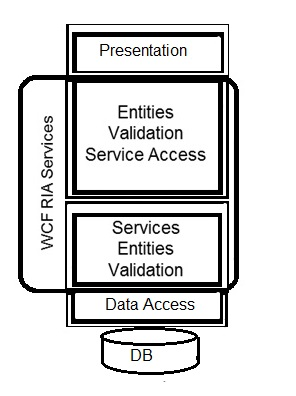

创建WCF RIA Service在下一步会有一个更深入的了解。按照下面给出的按部就班地进行就可以了。

步骤1：使用Silverlight5创建名为SLWCFRiaServices.Web的一个新的Web项目，然后选择ADO.NET实体数据模型，以相同的添加一个新的项目。

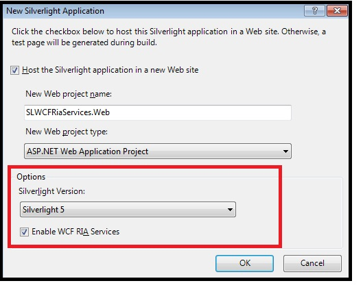

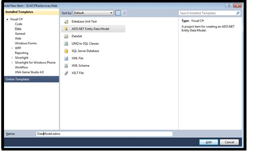

第2步：现在，通过生成从数据库模型选择的实体数据模型向导模式的内容。

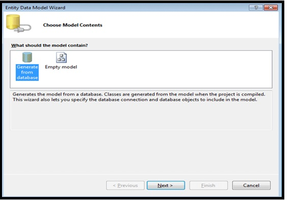

步骤3：从同一个向导，请选择数据连接和数据库对象。

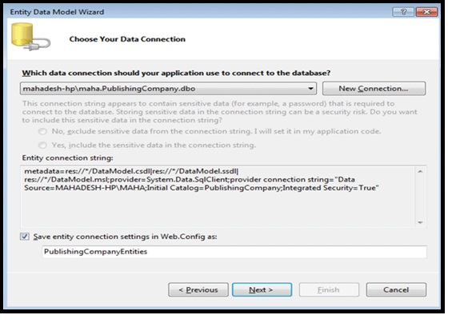

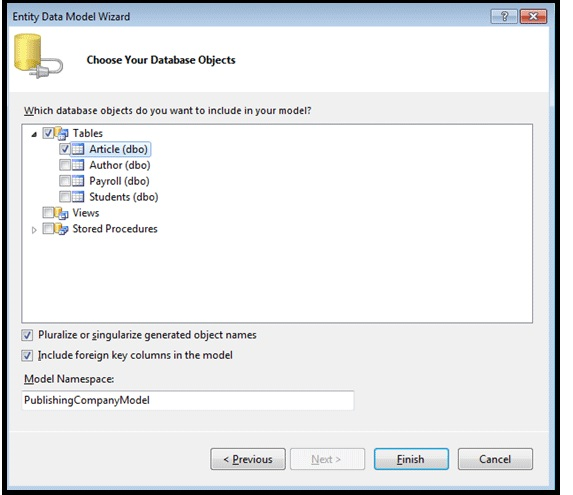

第4步：生成解决方案，以便在未来的认识的数据模型是不是要创建的域名服务问题。

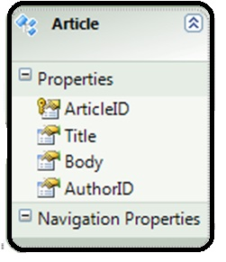

第5步：现在，通过添加新的项目创建在Web项目中的域名服务，确保让客户端访问。

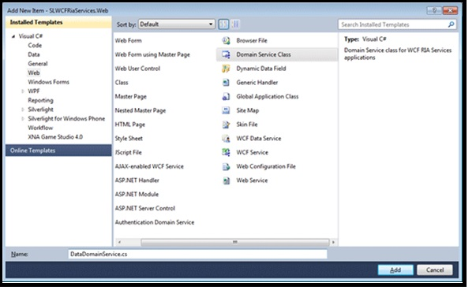

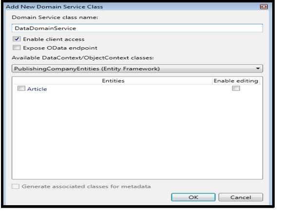

步骤6：在紧接着的下一个步骤，产生了一些类的会发生，因此有必要再次构建它们。

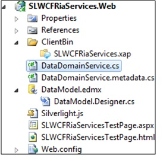

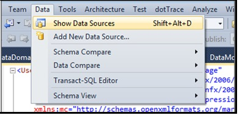

第7步：在这一步，DataDomainContext示出了数据源面板。

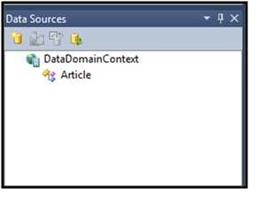

第8步：下面DataDomainContext文章应选择并应进行定制。

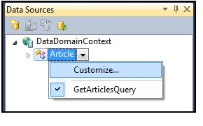

第9步：连接DataGrid控件的数据源是在这里承诺以及选择的主题，如在此步骤BureauBlue主题已被选中。

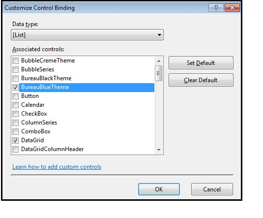

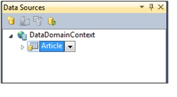

步骤10：最后一个和最后步骤包括将要设计的屏幕，并通过简单的拖放添加实体在MainPage布局面积。同样重要的是要确保AutoGenerateColumns=“true”，并运行它来查看输出。

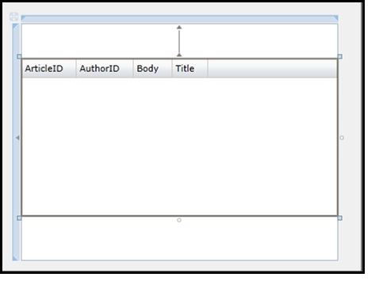

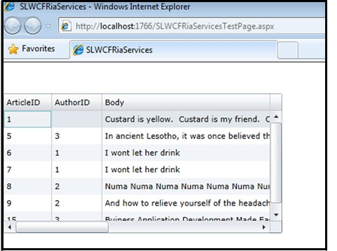

## 先决条件

有一些先决条件经历WCF RIA服务的攻略，如下面。

*   Visual Studio 2010/ Visual Studio 2012
*   Silverlight Developer Runtime
*   Latest version of RIA Services Toolkit
*   SDK (Software Development Kit)

## WCF RIA域名服务

一个域的服务包括一组相关的业务数据操作，并没有什么，但它暴露任何WCF RIA服务应用程序的业务逻辑WCF服务。

一个WCF RIA域名服务有内部托管类DomainServiceHost又使用WCF的ServiceHost类的托管应用程序。为了让域名访问服务的客户端项目，它应该有EnableClientAccessAttribute属性。每当一个新的域服务类添加属性得到自动应用。

下图显示了WCF RIA域名服务的体系结构

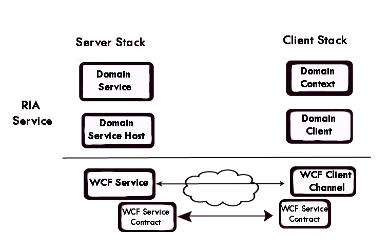

## WCF RIA Services数据查询

下面的图显示了如何将查询客户端上创建和在服务器侧执行返回Jqueryable结果。但必须注意的是，DAL是这里的数据访问层。

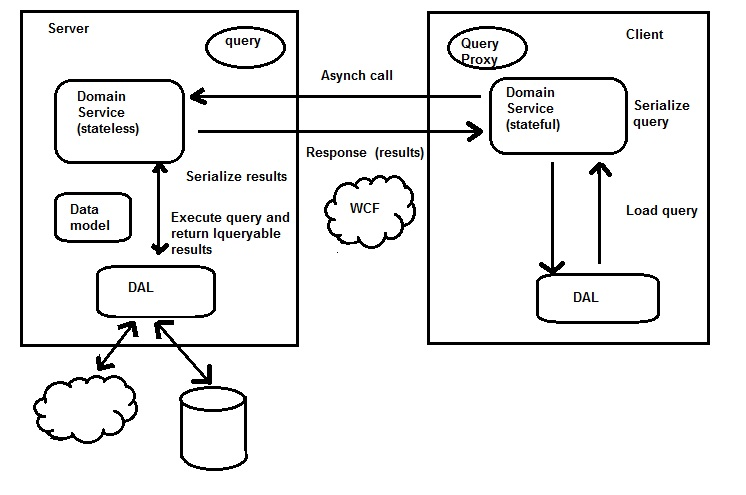

## WCF RIA Services更新数据

该图显示了数据是如何通过执行CUD更新服务器端（创建，更新，删除）操作。这里应注意的是，WCF RIA服务总是无状态的服务器端。

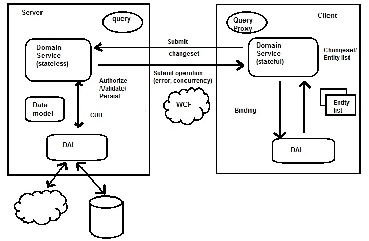

