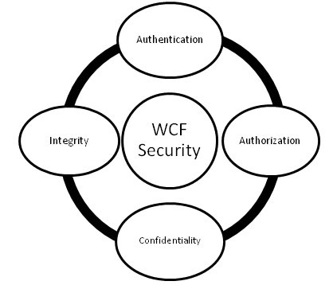

# WCF安全 - WCF教程

一个强大的WCF服务安全系统，拥有两种安全模式或级别预期的客户端可以访问的服务。这是常见的分布式事务的安全威胁正在放缓，在很大程度上由WCF决定。

## 关键的安全功能

WCF服务有四个主要的安全功能，如下图所示。



*   **认证**- 这里认证是不限定于识别消息的发送者，但是相互的，即消息接收器的认证是必需的，以排除任何种类的中间人攻击的可能性。

*   **授权**- 这是采取了一个WCF服务，以确保安全性的下一步骤，并在此确定服务是否应授权调用方进一步或不会进行。虽然授权不依赖于身份验证时，它通常如下认证。

*   **保密** - 调用者和服务之间的信息交流是保密的，限制其解释并不打算为其他人公开消息。为了使这成为可能，加密与各种各样的其他机制一起使用。

*   **完整性**- 最后一个关键概念是保持完整性，即提供了保证，该消息尚未从发送者到接收者不被任何人在这一过程篡改。

## 传输安全模式

WCF提供以下传输安全模式，以确保在客户机和服务器之间的安全通信。多样传输安全模式如下所述。

*   **None **- 此模式不能保证任何消息安全和服务不获取有关客户端的任何凭据。这种模式是非常危险的，因为它可以使信息被篡改，因此不推荐使用。

```
<wsHttpBinding>
   <binding name="WCFSecurityExample">
      <security mode="None"/>
   </binding>
</wsHttpBinding>
```

*   ****Transport ****- 这种模式是实现信息通过使用通信协议，如TCP，IPC，HTTPS和MSMQ一个安全的传输的最简单方法。这种模式是比较有效的，当在传输点至点，并主要是用于在受控环境中，也就是说，内部网应用。

```
<wsHttpBinding>
   <binding name="WCFSecurityExample">
      <security mode="Transport"/>
   </binding>
</wsHttpBinding>
```

*   **Message **- 安全模式可以相互验证，并提供隐私的消息进行加密，并且可以通过http，这不被认为是一种安全协议被传输在很大程度上。这里的安全性提供了端 - 端，而不考虑有多少中介参与消息传送和是否有一个安全的运输或没有。该模式是通过互联网应用程序通常使用。

```

<wsHttpBinding>
   <binding name="WCFSecurityExample">
      <security mode="Message"/>
   </binding>
</wsHttpBinding>
```

*   **Mixed **- 这种安全模式是不经常使用，客户端身份验证仅在客户端级别提供。

```

<wsHttpBinding>
   <binding name="WCFSecurityExample">
      <security mode="TransportWithMessageCredential"/>
   </binding>
</wsHttpBinding>
```

*   **Both **- 此安全方式包括两种传输安全性和信息的安全性，提供了健壮的安全盖，但通常会导致超载的整体性能。这一个仅由MSMQ支持。

```

<netMsmqBinding>
   <binding name="WCFSecurityExample">
      <security mode="Both"/>
   </binding>
</netMsmqBinding>
```

所有的WCF绑定，除非有basicHttpBinding传输安全性默认情况下有一定关系。

## 消息安全级别

消息级安全性不依赖于WCF协议。它是通过使用一个标准的算法对数据进行加密采用与消息数据本身。有若干客户端凭证可用于不同的绑定的消息的安全级别，这些将在下面讨论。

WCF消息级安全性的客户端证书

None :在此，使用加密来保护该消息而被执行，这意味着，该服务可以由一个匿名客户访问没有客户机认证。除了basicHttpBinding，所有的WCF绑定支持此客户端凭据。然而，应当注意的是，对于NetNamedPipeBinding客户端凭证不可用。

*   Windows - 在这里无论是信息的加密和认证的客户端发生了一个实时登录的用户。在此情况下，也不同于所有其他的WCF绑定，NetNamedPipeBinding不可用以及basicHttpBinding不提供支持。

*   UserName - 这里消息被加密，以及通过提供用户名固定，而客户端进行认证，因为它们需要提供密码。 basicHttpBinding就像上面的两个客户端凭证，不支持用户名和它不适用于NetNamedPipeBinding。

*   Certificate - 随着信息加密，客户端和服务获得与证书的身份验证。此客户端证书可用，并且支持所有的WCF绑定，除了NetNamedPipeBinding。

*   IssuedToken - 类似CardSpace从一个机构颁发的令牌用于验证的消息。这里也进行消息的加密。

下面的代码显示了客户端凭据如何配置WCF的信息安全等级/模式。

```
<netTcpBinding>
   <binding name="WCFMessageSecurityExample">
      <security mode="Message">
         <message clientCredentialType="None"/>
      </security>   
   </binding>
</netTcpBinding>

<netMsmqBinding>...</netMsmqBinding>
</bindings>
<behaviors>...</behaviors>
```

这里，必须指出的是，传输安全模式具有超过该消息的安全级别的边缘，因为前者是更快。它不需要任何额外的编码，并提供互操作性的支持，并且因此不会降低整体性能。

然而，从安全角度考虑，将消息安全模式是更加健壮，并且独立的协议，并提供端到端的安全性。

