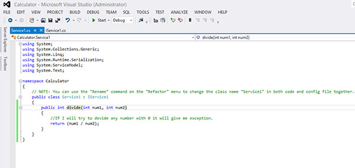
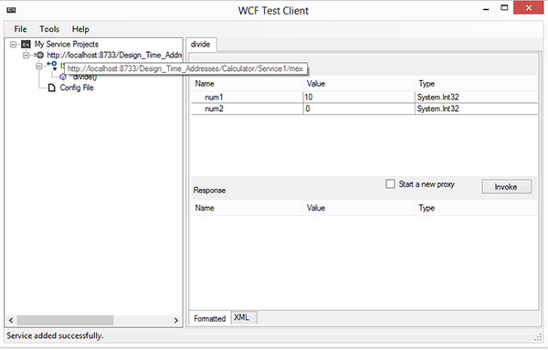
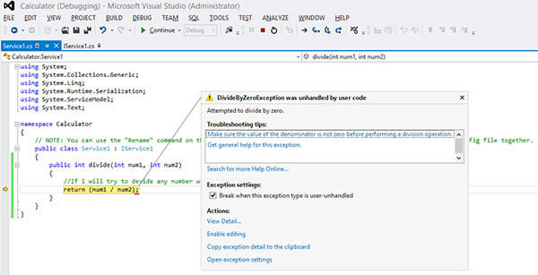
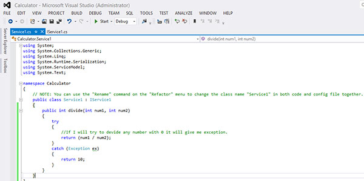
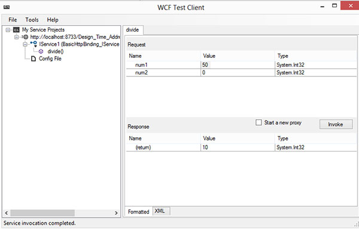
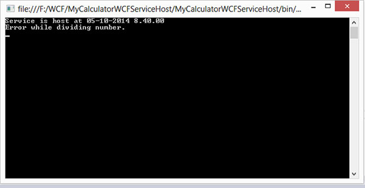

# WCF异常处理 - WCF教程

WCF服务开发者可能会遇到需要以适当的方式向客户端报告一些不可预见的错误。这样的错误，称为异常，通常是通过使用try/catch块来处理，但同样，这是非常具体的技术。

由于客户端的关注领域不是关于如何发生错误或因素导致的错误，SOAP错误的约定，用于从WCF服务的传送到客户端的错误消息。

故障分析合约使客户端能够发生在一个服务错误的文件视图。下面的例子给出了一个更好的了解。

步骤1：一个简单的计算器服务与除法运算，将创建一般常见的异常。

```
using System;
usingSystem.Collections.Generic;
usingSystem.Linq;
usingSystem.Runtime.Serialization;
usingSystem.ServiceModel;
usingSystem.Text;

namespace Calculator
{
   // NOTE: You can use the "Rename" command on the "Refactor" menu to change
   // the interface name "IService1" in both code and config file together.

   [ServiceContract]

   public interface IService1
   {
      [OperationContract]
      int divide(int num1, int num2);
      // TODO: Add your service operations here by www.yiibai.com
   }
}
```

该类编码文件显示如下：


现在，当我们试图让10除以零，计算服务将抛出一个异常。




该异常可以通过try/catch块来处理。


现在，当我们试图让任何整数除以0，它会因为我们在catch块中处理其返回值10。


步骤-2：FaultException异常用于在该步骤中进行通信的异常信息从服务客户端返回。

```
public int Divide(int num1, int num2)
{
   //Do something
   throw new FaultException("Error while dividing number");
}
```


